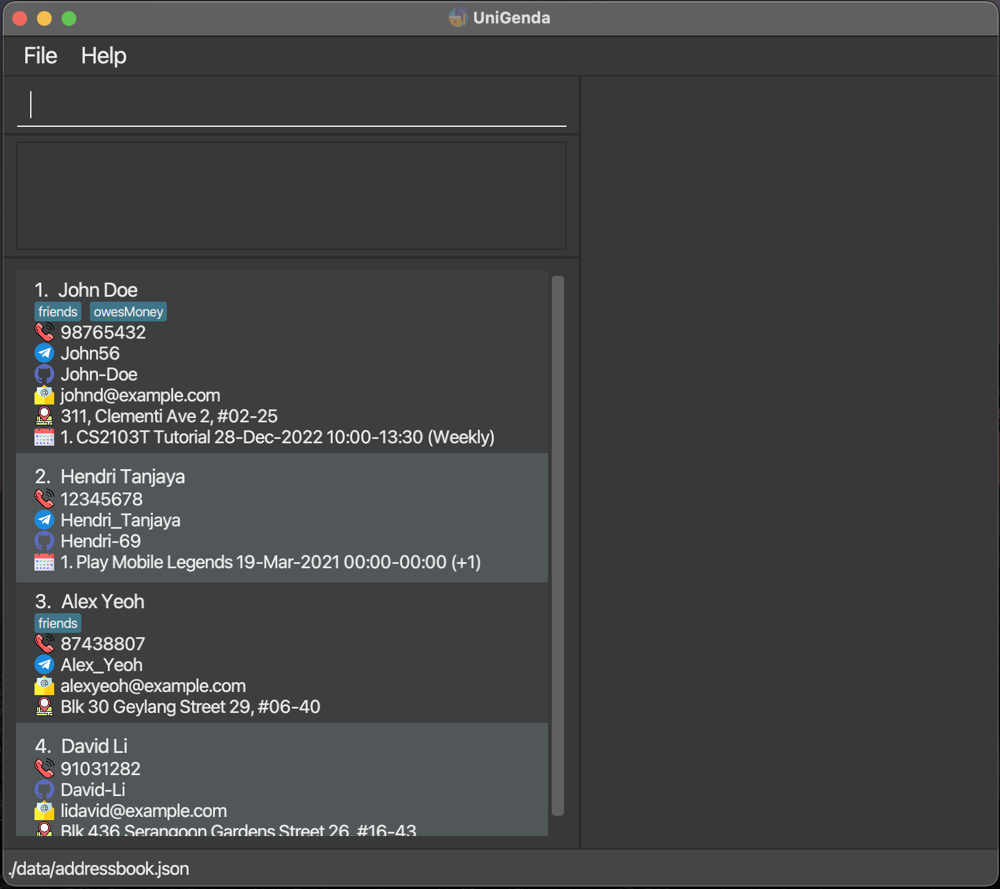

* This is **UniGenda**, an address book application optimized for University student. 
  Example usages:
  * as an application to store your friends' contact information
  * as an application to find a meeting time with your friends
* The project is built on a sample software project for a desktop application (called _AddressBook_) used for managing contact details. Similar with the code base,
  * It is **written in OOP fashion**. It provides a **reasonably well-written** code base **bigger** (around 6 KLoC) than what students usually write in beginner-level SE modules, without being overwhelmingly big.
  * It comes with a **reasonable level of user and developer documentation**.
* It is named `UniGenda` because it was supposed to be an `aGenda` for `University students`.
* For the detailed documentation of this project, see the **[UniGenda Official Website](https://ay2122s2-cs2103t-w09-1.github.io/tp/)**
* For the detailed documentation of the code base, see the **[Address Book Product Website](https://se-education.org/addressbook-level3/)**.
* This project is a **part CS2103T: Software Engineering** module in NUS.
