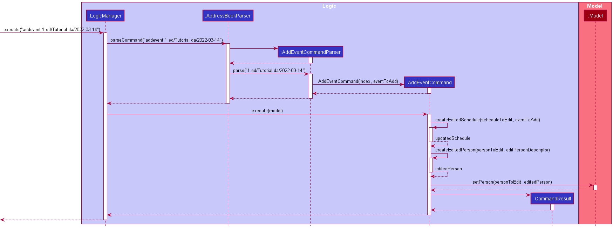
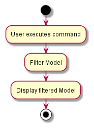

* Table of Contents
{:toc}

--------------------------------------------------------------------------------------------------------------------

## **Acknowledgements**

* Code base: [addressbook-level3](https://github.com/se-edu/addressbook-level3)
* These are the sources of the images that we used in this project (all images referred in this section is available on `/src/main/resources/images`):
    * unigenda.png : <a href="https://www.flaticon.com/free-icons/book" title="book icons">Book icons created by Freepik - Flaticon</a>
    * phone_icon.png : <a href="https://www.flaticon.com/free-icons/phone" title="phone icons">Phone icons created by Freepik - Flaticon</a>
    * telegram_icon.png : <a href="https://www.flaticon.com/free-icons/telegram" title="telegram icons">Telegram icons created by Pixel perfect - Flaticon</a>
    * github_icon.png : <a href="https://www.flaticon.com/free-icons/github" title="github icons">Github icons created by Pixel perfect - Flaticon</a>
    * email_icon.png : <a href="https://www.flaticon.com/free-icons/email" title="email icons">Email icons created by Freepik - Flaticon</a>
    * address_icon.png : <a href="https://www.flaticon.com/free-icons/address" title="address icons">Address icons created by Freepik - Flaticon</a>
    * schedule_icon.png : <a href="https://www.flaticon.com/free-icons/calendar" title="calendar icons">Calendar icons created by Freepik - Flaticon</a>
    * upcoming_schedule_icon.png : <a href="https://www.flaticon.com/free-icons/upcoming" title="upcoming icons">Upcoming icons created by Freepik - Flaticon</a>
    * days.png : <a href="https://www.flaticon.com/free-icons/calendar" title="calendar icons">Calendar icons created by Creaticca Creative Agency - Flaticon</a>

--------------------------------------------------------------------------------------------------------------------

## **Setting up, getting started**

Refer to the guide [_Setting up and getting started_](SettingUp.md).

--------------------------------------------------------------------------------------------------------------------

## **Design**

:bulb: **Tip:** The `.puml` files used to create diagrams in this document can be found in the [diagrams](https://github.com/AY2122S2-CS2103T-W09-1/tp/tree/master/docs/diagrams/) folder. Refer to the [_PlantUML Tutorial_ at se-edu/guides](https://se-education.org/guides/tutorials/plantUml.html) to learn how to create and edit diagrams.

### Architecture

The ***Architecture Diagram*** given above explains the high-level design of the App.

Given below is a quick overview of main components and how they interact with each other.

**Main components of the architecture**

**`Main`** has two classes called [`Main`](https://github.com/AY2122S2-CS2103T-W09-1/tp/blob/master/src/main/java/seedu/address/Main.java) and [`MainApp`](https://github.com/AY2122S2-CS2103T-W09-1/tp/blob/master/src/main/java/seedu/address/MainApp.java). It is responsible for,
* At app launch: Initializes the components in the correct sequence, and connects them up with each other.
* At shut down: Shuts down the components and invokes cleanup methods where necessary.

[**`Commons`**](#common-classes) represents a collection of classes used by multiple other components.

The rest of the App consists of four components.

* [**`UI`**](#ui-component): The UI of the App.
* [**`Logic`**](#logic-component): The command executor.
* [**`Model`**](#model-component): Holds the data of the App in memory.
* [**`Storage`**](#storage-component): Reads data from, and writes data to, the hard disk.

**How the architecture components interact with each other**

The *Sequence Diagram* below shows how the components interact with each other for the scenario where the user issues the command `delete 1`.

Each of the four main components (also shown in the diagram above),

* defines its *API* in an `interface` with the same name as the Component.
* implements its functionality using a concrete `{Component Name}Manager` class (which follows the corresponding API `interface` mentioned in the previous point.

For example, the `Logic` component defines its API in the `Logic.java` interface and implements its functionality using the `LogicManager.java` class which follows the `Logic` interface. Other components interact with a given component through its interface rather than the concrete class (reason: to prevent outside component's being coupled to the implementation of a component), as illustrated in the (partial) class diagram below.

The sections below give more details of each component.

### UI component

The **API** of this component is specified in [`Ui.java`](https://github.com/AY2122S2-CS2103T-W09-1/tp/blob/master/src/main/java/seedu/address/ui/Ui.java)

The UI consists of a `MainWindow` that is made up of parts e.g.`CommandBox`, `ResultDisplay`, `PersonListPanel`, `StatusBarFooter` etc. All these, including the `MainWindow`, inherit from the abstract `UiPart` class which captures the commonalities between classes that represent parts of the visible GUI.

The `UI` component uses the JavaFx UI framework. The layout of these UI parts are defined in matching `.fxml` files that are in the `src/main/resources/view` folder. For example, the layout of the [`MainWindow`](https://github.com/se-edu/addressbook-level3/tree/master/src/main/java/seedu/address/ui/MainWindow.java) is specified in [`MainWindow.fxml`](https://github.com/se-edu/addressbook-level3/tree/master/src/main/resources/view/MainWindow.fxml)

The `UI` component,

* executes user commands using the `Logic` component.
* listens for changes to `Model` data so that the UI can be updated with the modified data.
* keeps a reference to the `Logic` component, because the `UI` relies on the `Logic` to execute commands.
* depends on some classes in the `Model` component, as it displays `Person` object residing in the `Model`.

### Logic component

**API** : [`Logic.java`](https://github.com/AY2122S2-CS2103T-W09-1/tp/blob/master/src/main/java/seedu/address/logic/Logic.java)

Here's a (partial) class diagram of the `Logic` component:

How the `Logic` component works:
1. When `Logic` is called upon to execute a command, it uses the `AddressBookParser` class to parse the user command.
1. This results in a `Command` object (more precisely, an object of one of its subclasses e.g., `AddCommand`) which is executed by the `LogicManager`.
1. The command can communicate with the `Model` when it is executed (e.g. to add a person).
1. The result of the command execution is encapsulated as a `CommandResult` object which is returned back from `Logic`.

The Sequence Diagram below illustrates the interactions within the `Logic` component for the `execute("delete 1")` API call.

:information_source: **Note:** The lifeline for `DeleteCommandParser` should end at the destroy marker (X) but due to a limitation of PlantUML, the lifeline reaches the end of diagram.

Here are the other classes in `Logic` (omitted from the class diagram above) that are used for parsing a user command:

How the parsing works:
* When called upon to parse a user command, the `AddressBookParser` class creates an `XYZCommandParser` (`XYZ` is a placeholder for the specific command name e.g., `AddCommandParser`) which uses the other classes shown above to parse the user command and create a `XYZCommand` object (e.g., `AddCommand`) which the `AddressBookParser` returns back as a `Command` object.
* All `XYZCommandParser` classes (e.g., `AddCommandParser`, `DeleteCommandParser`, ...) inherit from the `Parser` interface so that they can be treated similarly where possible e.g, during testing.

### Model component
**API** : [`Model.java`](https://github.com/AY2122S2-CS2103T-W09-1/tp/blob/master/src/main/java/seedu/address/model/Model.java)

The `Model` component,

* stores the address book data i.e., all `Person` objects (which are contained in a `UniquePersonList` object).
* stores the currently 'selected' `Person` objects (e.g., results of a search query) as a separate _filtered_ list which is exposed to outsiders as an unmodifiable `ObservableList<Person>` that can be 'observed' e.g. the UI can be bound to this list so that the UI automatically updates when the data in the list change.
* stores a `UserPref` object that represents the user’s preferences. This is exposed to the outside as a `ReadOnlyUserPref` objects.
* does not depend on any of the other three components (as the `Model` represents data entities of the domain, they should make sense on their own without depending on other components)

:information_source: **Note:** An alternative (arguably, a more OOP) model is given below. It has a `Tag` list in the `AddressBook`, which `Person` references. This allows `AddressBook` to only require one `Tag` object per unique tag, instead of each `Person` needing their own `Tag` objects. 

### Storage component

**API** : [`Storage.java`](https://github.com/AY2122S2-CS2103T-W09-1/tp/blob/master/src/main/java/seedu/address/storage/Storage.java)

The `Storage` component,
* can save both address book data and user preference data in json format, and read them back into corresponding objects.
* inherits from both `AddressBookStorage` and `UserPrefStorage`, which means it can be treated as either one (if only the functionality of only one is needed).
* depends on some classes in the `Model` component (because the `Storage` component's job is to save/retrieve objects that belong to the `Model`)

### Common classes

Classes used by multiple components are in the `seedu.addressbook.commons` package.

--------------------------------------------------------------------------------------------------------------------

## **Implementation**

This section describes some noteworthy details on how certain features are implemented.

###  Add Event Feature

#### Implementation

To enable users to track their contacts' schedules, 2 new classes have been added: `Schedule` and `Event`
* Each `Person` has a `Schedule` attribute.
* A `Schedule` contains a list of `Event`s.
* An `Event` has an `EventDescription`, a `LocalDate`, a `LocalTime`, a `Duration` and a `RecurFrequency`
  * Here, the `RecurFrequency` indicates how often the `Event` occurs, which can be daily, weekly, biweekly or none.

  

To add an `Event` to a contact's `Schedule`, the user needs to run the AddEvent command.
The parsing of the `addEvent` command is handled by the following classes:
* `AddressBookParser`
  * Checks that the user input contains the AddEventCommand.COMMAND_WORD and calls `AddEventCommandParser#parse()`
* `AddEventCommandParser`
  * Parses the user input to create an `Index` of the contact whose `Schedule` should be edited, along with an `Event` to add to the `Person`'s `Schedule`
  * Returns an `AddEventCommand` to be executed by the `LogicManager`

A successful execution of the `addEvent` command is described as follows:
1. The `AddEventCommand` retrieves the currently listed `Person`s from the `Model`.
2. The `personToEdit` is obtained from the above list using the `Index` created during the parsing of the AddEvent command.
3. `AddEventCommand` gets the `Schedule` of the `personToEdit` and creates a new `Schedule` with the added `Event` created during the parsing of the AddEvent command.
4. `AddEventCommand` creates a new `Person` with the updated `Schedule` and uses `Model#setPerson()` to replace the `personToEdit` with the `Person` with the updated `Schedule`.
5. `AddEventCommand` constructs the `CommandResult` and returns it to the `LogicManager`.

  

#### Design considerations
**Differentiating recurring events and non-recurring events**
* **Alternative 1 (current choice):** Every `Event` has a `RecurFrequency` attribute. `RecurFrequency` has a `None` value to represent non-recurring tasks
  * Pros: Easier to implement, no need to deal with Jackson library deciphering whether data should be recurring or non-recurring type
* **Alternative 2:** Have a `RecurringEvent` class inherit from `Event` and only `RecurringEvent`s should have the `RecurFrequency` attribute
  * Pros: Slightly more OOP
  * Cons:
    * Difficult to implement, increases likelihood of bugs and may take more time to implement should we misunderstand how Jackson library deciphers data.
    * More awkward type checking and casting when checking for recurrence.
**Implementing event's date, time and duration attributes**
* **Alternative 1 (current choice):** Use Java's in built LocalDate, LocalTime and Duration classes
  * Pros: Easier to implement, no need to account for leap years, number of days in a month, formatting etc. Also has inbuilt support to calculate time.
* **Alternative 2:** Create our own Date, Time and Duration classes
  * Pros: More customisable
  * Cons: Higher possibility of bugs if we do not properly account for leap years, number of days in a month, formatting etc. Will also take too much time to implement
**Updating the model when an event is added**
* **Alterative 1 (current choice):** Create a new `Schedule` and `Person` to update the `Model`
  * Pros: More defensive
  * Cons: Troublesome to implement
* **Alternative 2:** Add an addEvent() function to `Schedule`, allows us to update the `Person` without creating objects
  * Pros: Straightforward to implement
  * Cons: In case a `Schedule` becomes unintentionally shared between 2 or more `Person`s, the editing of 1 `Person`'s `Schedule` when updating the `Model` may result in multiple `Person`s' `Schedule`s being edited at the same time, causing bugs to appear

### WhoIsFree feature
This section details how the `whoIsFree` command is implemented. This command allows the user to find contacts who are free at the specified time and date. Contacts who are free will be listed in the contact list.

#### Implementation
`WhoIsFreeCommandParser`, `WhoIsFreeCommand` and `IsPersonFreePredicate` classes are involved in the execution of the `whoIsFree` command.

The `parse` method inside the `WhoIsFreeCommandParser` receives the user input and extracts the required arguments. It then creates a new `IsPersonFreePredicate` object that will help check if the user's contacts' schedule coincides with the specified time and date.

Given below is one example usage scenario and explanation on how the `whoIsFree` command behaves at each step. You may also refer to the sequence diagram below.

1. The user enters `whoIsFree ti/10:00 da/2022-03-24` to find if there are any contacts who are free at the specified time and date. The arguments `ti/10:00 da/2022-03-24` are passed to the `WhoIsFreeCommandParser` through its `parse` method call.
2. The user input `ti/10:00 da/2022-03-24` will be checked to ensure that empty input is not given. At the same time, `ParserUtil#parseTime` and `ParserUtil#parseDate` are used to check for invalid inputs.
3. A new `IsPersonFreePredicate` object is created and encapsulated by a new `WhoIsFreeCommand` object.
4. The `WhoIsFreeCommand` object is returned to the `LogicManager`.
5. During the execution of the command, the `WhoIsFreeCommand` object calls `Model#updateFilteredPersonList` method with the `IsPersonFreePredicate` to update the display of the current list of contacts. If there are contacts who are free at the specified time and date, then a list of the contacts who are free will be shown. Otherwise, an empty list will be shown.
6. A `CommandResult` with the number of contacts free is returned. A list of contacts who are free will also be displayed to the user.

#### Sequence Diagram
The following sequence diagram shows how the `whoIsFree` command works for the example above: 

#### Activity Diagram
The following activity diagram summarizes what happens when the `whoIsFree` command is triggered: 

#### Design Considerations
**Aspect: Should we allow dates that have already passed?**
* **Alternative 1 (current implementation)**: Ignore dates that have passed.
  * Pro:
    * Prevents users from expecting the wrong results when recurring events are involved.
  * Cons:
    * Harder implementation as we would have to consider all events with respect to today.
* **Alternative 2**: Treat the past dates as a normal dates.
  * Pros:
    * Easy implementation as there is nothing special to take note.
  * Con:
    * Does not make sense to check dates have already passed.

**Aspect: What to do with contacts who do not have a schedule?**
* **Alternative 1**: Contacts without schedule are always free
  * Cons:
    * Contacts without schedule may not be free at the specified date and time.
    * We will have to check all contacts for their schedule and display all contacts.
* **Alternative 2 (current implementation)**: Contacts without schedule are always busy
  * Pros:
    * Higher certainty that contacts shown will be free.
    * Less information to process as we ignore contacts without schedule.
  * Con:
    * Contacts without schedule may be free at the specified date and time.

### View Schedule Feature

Views a person's schedule that will be displayed in the right panel.

#### Implementation

To allow users to view their contact's schedules, we implemented a `ViewScheduleCommand`, and added a `FilteredList<Person>` object in `ModelManager` to facilitate its execution.

Moreover, we created `ScheduleCard.java`, `ScheduleCardPanel.java`, and their respective `.fxml` files so it will be easier to maintain or develop the GUI in the future.

Overall, how this command works is similar to a combination of `delete` and `find`, in which we only take an index as input, and we retrieve information based on the filtered list.

To **view** a person's schedule, the user needs to run the `viewSchedule` command.
The parsing of the viewSchedule command is handled by the following classes:
* `AddressBookParser`
    * Checks that the user input contains the ViewScheduleCommand.COMMAND_WORD and calls `ViewScheduleCommandParser#parse()`.
* `ViewScheduleCommandParser`
    * Parses the user input to create an `Index` of the person to view.
    * Returns a `ViewScheduleCommand` to be executed by the `LogicManager`.
    * In case of invalid index, it will be handled by the `ViewScheduleCommand` upon execution.

A successful execution of the `viewSchedule` command is described as follows:
1. The `ViewScheduleCommand` retrieves the currently listed `Person`'s from the `Model`.
2. The `personToView` is obtained from the above list using the `Index` created during the parsing of the viewSchedule command.
3. `ViewScheduleCommand` creates a new `SamePersonPredicate` that returns `True` only if the tested `Person` equals to `personToView`.
4. `ViewScheduleCommand` updates the `Model`'s `viewedPerson` (the `FilteredList<Person>` object) by parsing in the `SamePersonPredicate`.
5. `ViewScheduleCommand` constructs the `CommandResult` and returns it to the `LogicManager`.
6. The GUI will be updated accordingly.

##### Design Considerations
##### viewedPerson as FilteredList or a Person.
**Aspect: Should viewedPerson be a FilteredList of a Person?**
* **Alternative 1 (current choice):** viewedPerson as a FilteredList
    * Pros: Easier to implement, easier to develop if in the future we want to display more than one Person.
    * Cons: Not intuitive since now the viewSchedule command only support viewing one Person.
* **Alternative 2:** viewedPerson as a Person
    * Pros: More intuitive because it **is** the displayed Person's Schedule we are interested in.
    * Cons: Can only view one Person at any time, need to change the implementation when developer wants to display more than one Person.

**Aspect: What attributes should be displayed in the right panel upon calling viewSchedule?**
* **Alternative 1 (current choice):** Displays Name, Tags, and Schedule; No Schedule on Person List
    * Pros: Cleaner look of Person List, can display more detailed version of Events.
    * Cons: User doesn't know if a particular Person in the Person List has any Schedule or not.
* **Alternative 2:** All attributes of a Person both on Schedule and Person List
    * Pros: More detailed version of a Person, so the user doesn't need to look in both panels to get all the information of a Person.
    * Cons: Person List display only fits a few Persons at a time.
    
### View Group Feature
View Group feature allows the user to be able to view a list of contacts who share the same tag.

#### Implementation
`ViewGroupParser`, `ViewGroupCommand` and `IsTagInPersonPredicate` classes are involved in the execution of the `ViewGroup` command.

The parsing of viewGroup command is handled by the following classes:
* 'AddressBookParser'
    * Checks that the user input contains the ViewGroupCommand.COMMAND_WORD  and calls `ViewGroupParser#parse()`
* `ViewGroupParser`
    * Parses the user input to extract the required arguments.
    * Creates a new `IsTagInPersonPredicate` object that will help check if contacts in the address book have the tag that the user has inputted.
    * Returns a `ViewGroupCommand` to be executed by the `LogicManager`.

Given below is an example usage scenario and explanation on how the 'viewGroup' command behaves at each step.

1. The user enters 'viewGroup t/friends' to find the contacts who share the same tag.
The argument 't/friends' is passed to the 'viewGroupParser' through its 'parse' method call.

2. The user input 't/friends' will be checked to ensure that empty input is not given.

3. A new 'IsTagInPersonPredicate' object is created and encapsulated by a new 'ViewGroup'
object.

4. The 'ViewGroup' object is returned to the 'LogicManager'.

5. During the execution of the command, the 'ViewGroup' object calls 'Model#updateFilteredPersonList' method with the 'IsTagInPersonPredicate' to get the list of contacts that share the same tag. 

6. A `CommandResult` with the number of contacts free is returned. A list of contacts who share the same tag will also be displayed to the user.

####Design Considerations

**Aspect: What is an attribute of a person that a user would want to filter contacts by?**
* **Alternative 1 (current choice):** Filter by tag
    * Pros: People who share the same tag are likely to be from the same group of friends, hence a user would be able to view the details or schedule of those contacts more easily using such a command.
    * Cons: Not able to filter by another attribute of a person such as whether person has schedule or not.
* **Alternative 2:** Filter by whether person has schedule or not.
    * Pros: It allows the user to view the contacts whom they have added their schedule to. These contacts can be assumed to be closer to the user as the user has added a schedule to them, hence a user is more likely to plan a meetup with such contacts.
    * Cons: Ultimately, a tag is still the best way for users to distinguish between groups of friends and had this implementation been enforced, users would not have been allowed to filter contacts by tag.

### Find Common Timing Feature
Find Common Timing feature allows the user to get the common free timings of contacts who share the same tag at a specified date.
The timings that the contacts are free at the specified date will be displayed.

#### Implementation
`FindCommonTimingParser`, `FindCommonTimingCommand` and `IsTagInPersonPredicate` classes are involved in the execution of the `findCommonTiming` command.

The parsing of findCommonTiming command is handled by the following classes:
* `AddressBookParser`
    * Checks that the user input contains the FindCommonTimingCommand.COMMAND_WORD and calls `FindCommonTimingParser#parse()`
* `FindCommonTimingParser`
    * Parses the user input to extract the required arguments.
    * Creates a new `IsTagInPersonPredicate` object that will help check if contacts in the address book have the tag that the user has inputted.
    * Returns a `FindCommonTimingCommand` to be executed by the `LogicManager`.

Given below is an example usage scenario and explanation on how the 'findCommonTiming' command behaves at each step.

1. The user enters 'findCommonTiming t/friends da/2022-03-04' to find the common timings that the contacts who share the same tag are free. 
The arguments 't/friends da/2022-03-04' are passed to the 'findCommonTimingParser' through its 'parse' method call.

2. The user input 't/friends da/2022-03-04' will be checked to ensure that empty input is not given.

3. A new 'IsTagInPersonPredicate' object is created and encapsulated by a new 'FindCommonTiming'
object.

4. The 'FindCommonTiming' object is returned to the 'LogicManager'.

5. During the execution of the command, the 'FindCommonTiming' object calls 'Model#updateFilteredPersonList' method with the 'IsTagInPersonPredicate' to get the list of contacts that share the same tag. 
The schedules of all the contacts will be consolidated and events will be checked if they occur on the date inputted by the user.
A default timeslot will be created such that it will be assumed that the whole day is free, after which 30-minute timeslots will be blocked out according to events that are determined to occur on that particular date.

6. A 'CommandResult' with the timeslots that the contacts are free will be returned(timeslots are in intervals of 30 minutes). 
These timeslots will then be displayed to the user.

#### Design Considerations
**Aspect: Should we show timings that a group of contacts with the same tag are free by the minute, or in 30-minute blocks?**
* **Alternative 1 (current implementation)**: Show common free timings in 30-minute blocks.
    * Pros:
        * More efficient implementation as 30-minute intervals would be ruled out as compared to 1-minute intervals
        * More easily understood by users who are likely to plan meetings in 30-minute intervals
    * Con:
        * More meticulous planners will lament a lack of an ability to include intervals of less than 30 minutes.
* **Alternative 2**: Show common free timings accurate to the minute
    * Pros:
        * Feature would work for even the most meticulous of planners and could perhaps increase the benefit of the feature marginally
    * Con:
        * Efficiency of implementation would be compromised to cater to a smaller target group.

### ExportSchedule feature
This section details how the `exportSchedule` command is implemented. This command allows the user to export the schedule of contacts in UniGenda.

#### Implementation
`ExportScheduleCommandParser` and `ExportScheduleCommand` classes are involved in the execution of the `exportSchedule` command.

The `parse` method inside the `ExportScheduleCommandParser` receives the user input and extracts the required arguments. It will then get the `Schedule` of specified `Person` corresponding to the user input and save the schedule in Json format.

Given below is one example usage scenario and explanation on how the `exportSchedule` command behaves at each step. You may also refer to the sequence diagram below.

1. The user enters `exportSchedule 1` as the command to export the schedule of specified person. The argument `1` is passed to the `ExportScheduleCommandParser` through its `parse` method call.
2. The user input `1` will be checked to ensure that empty input is not given. At the same time, `ParserUtil#parseIndex` is used to check for invalid or out of range inputs.
3. The `ExportScheduleCommand` object is returned to the `LogicManager`.
4. During the execution of the command, the `ExportScheduleCommand` object checks if the schedule that we are retrieving exists. If it exists, `JsonUtil#saveJsonFile` method will be called. We also ensure that the folder that we are trying to save to exist, if it does not exist, we will create the folder. The schedule is then immediately saved as a Json file.
5. A `CommandResult` object indicating that the `exportSchedule` command is successful will be created and returned to the `LogicManager`.

#### Sequence Diagram
The following sequence diagram shows how the `exportSchedule` command works for the example above:

#### Design Considerations
**Aspect: Where should we save the file?**
* **Alternative 1**: Users specify where they want the file to be saved.
    * Pro:
        * Users will be able to save wherever they like.
    * Con:
        * Harder to implement as we would have to check if the file path given is an absolute path or a relative path.

* **Alternative 2 (current implementation)**: We save the file to the data folder.
    * Pros:
        * Location for exported file will not change.
        * Do not have to check if the file path is an absolute path or a relative path.
    * Con:
        * Users will not be able to save the file where they like.
--------------------------------------------------------------------------------------------------------------------

## **Documentation, logging, testing, configuration, dev-ops**

* [Documentation guide](Documentation.md)
* [Testing guide](Testing.md)
* [Logging guide](Logging.md)
* [Configuration guide](Configuration.md)
* [DevOps guide](DevOps.md)

--------------------------------------------------------------------------------------------------------------------

## **Appendix: Requirements**

### Product scope

**Target user profile**:

* has a need to manage a significant number of contacts
* prefer desktop apps over other types
* can type fast
* prefers typing to mouse interactions
* is reasonably comfortable using CLI apps
* has friends with busy schedules
* wants to meet up with friends often

**Value proposition**: improve ease of finding common meeting times with contacts compared to mouse/GUI driven apps

### User stories

Priorities: High (must have) - `* * *`, Medium (nice to have) - `* *`, Low (unlikely to have) - `*`

| Priority | As a …​                       | I want to …​                                     | So that I can…​                                                        |
|----------|-------------------------------|--------------------------------------------------|------------------------------------------------------------------------|
| `* * *`  | new user                      | see usage instructions                           | refer to instructions when I forget how to use the App                 |
| `* * *`  | user                          | add a new person                                 |                                                                        |
| `* * *`  | user                          | delete a person                                  | remove entries that I no longer need                                   |
| `* * *`  | user                          | find a person by name                            | locate details of persons without having to go through the entire list |
| `* * *`  | user                          | add an event to my contact                       | refer to the contact's schedule on a later date                        |
| `* * *`  | user                          | edit an event on a person's schedule             | amend changes to my contact's schedule                                 |
| `* * *`  | user                          | delete an event on a person's schedule           | remove events that are no longer in my contact's schedule              |
| `* * *`  | user                          | view a person's schedule                         |                                                                        |
| `* *`    | user                          | set a person to be myself                        | see my information easily                                              |
| `* *`    | student with a lot of friends | see who are available at a particular time       | easily plan a meetup                                                   |
| `* *`    | student with a lot of friends | see which timings friends with same tag are free | plan a meetup with friends from the same group                         |

### Use cases

(For all use cases below, the **System** is the `UniGenda` and the **Actor** is the `user`, unless specified otherwise)

**Use case: Delete a person**

**MSS**

1.  User requests to list persons
2.  UniGenda shows a list of persons
3.  User requests to delete a specific person in the list
4.  UniGenda deletes the person

    Use case ends.

**Extensions**

* 2a. The list is empty.

  Use case ends.

* 3a. The given index is invalid.

    * 3a1. UniGenda shows an error message.

      Use case resumes at step 2.

**Use case: Add an event**

**MSS**

1. User requests to add an event to a specific person's schedule
2. UniGenda adds an event to the person's schedule

    Use case ends.

**Extensions**

* 1a. The specified date, time or duration of the event is invalid.

    * 1a1. UniGenda shows an error message.

    Use case ends.

* 1b. The user does not specify an event description or date.

    * 1b1. UniGenda shows an error message.

    Use case ends.

* 1c. The user specifies a duration for the event without specifying the start time.

    * 1c1. UniGenda shows an error message.

    Use case ends.

* 1d. The given index is invalid.

    * 1d1. UniGenda shows an error message.

    Use case ends.

**Use case: Edit an event**

**MSS**

1. User requests to edit a specific event on a specific person's schedule
2. UniGenda edits the event

   Use case ends.

**Extensions**

* 1a. The specified date, time or duration of the event, if any, is invalid.

    * 1a1. UniGenda shows an error message.

    Use case ends.

* 1b. The user edits an event's duration without specifying a start time (if the event does not already have one).

    * 1b1. UniGenda shows an error message.

    Use case ends.

* 1c. The specified contact index or event index is invalid.

    * 1c1. UniGenda shows an error message.

    Use case ends.

**Use case: Delete an event**

**MSS**

1. User requests to delete a specific event on a specific person's schedule
2. UniGenda deletes the event

   Use case ends.

**Extensions**

* 1a. The specified contact index or event index is invalid.

    * 1a1. UniGenda shows an error message.

    Use case ends.

*{More to be added}*

### Non-Functional Requirements

1. Should work on any _mainstream OS_ as long as it has Java `11` or above installed.
2. Should be able to hold up to 100 persons without a noticeable sluggishness in performance for typical usage.
3. A user with above average typing speed for regular English text (i.e. not code, not system admin commands) should be able to accomplish most of the tasks faster using commands than using the mouse.
4. Should be able to hold up to 1000 events across all persons without noticeable lag.

*{More to be added}*

### Glossary

* **Mainstream OS**: Windows, Linux, Unix, OS-X
* **Private contact detail**: A contact detail that is not meant to be shared with others
* **Event**: Something that happens
* **Schedule**: A list of Events
* **Main Success Scenario (MSS)**: Describes the most straightforward interaction for a given use case, which assumes that nothing goes wrong
* **Command Line Interface (CLI)**: Text-based user interface
* **Graphical User Interface (GUI)**: Graphic-based user interface

--------------------------------------------------------------------------------------------------------------------

## **Appendix: Instructions for manual testing**

Given below are instructions to test the app manually.

:information_source: **Note:** These instructions only provide a starting point for testers to work on;
testers are expected to do more *exploratory* testing.

### Launch and shutdown

1. Initial launch

   1. Download the jar file and copy into an empty folder

   1. Double-click the jar file Expected: Shows the GUI with a set of sample contacts. The window size may not be optimum.

1. Saving window preferences

   1. Resize the window to an optimum size. Move the window to a different location. Close the window.

   1. Re-launch the app by double-clicking the jar file. 
       Expected: The most recent window size and location is retained.

1. _{ more test cases …​ }_

### Deleting a person

1. Deleting a person while all persons are being shown

   1. Prerequisites: List all persons using the `list` command. Multiple persons in the list.

   1. Test case: `delete 1` 
      Expected: First contact is deleted from the list. Details of the deleted contact shown in the status message. Timestamp in the status bar is updated.

   1. Test case: `delete 0` 
      Expected: No person is deleted. Error details shown in the status message. Status bar remains the same.

   1. Other incorrect delete commands to try: `delete`, `delete x`, `...` (where x is larger than the list size) 
      Expected: Similar to previous.

1. _{ more test cases …​ }_

### Getting contacts who are free at specified time and date
1. Assuming that all contacts do not have a schedule.
   1. Test case: `freeSchedule ti/10:00 da/2022-05-01` 
      Expected: No contacts displayed.
   
   2. Test case: `freeSchedule ti/10:00`
      Expected: Same result as previous.

2. Assuming that some contacts have a schedule.
   Situation 1: All contacts are free today at 10am.
   1. Test case: `freeSchedule ti/10:00` 
      Expected: Displays all contacts with a schedule.
   
   Situation 2: All contacts are not free today at specified time.
   1. Test case: `freeSchedule ti/10:00` 
      Expected: No contacts displayed.
   
   Situation 3: Some contacts are free today at specified time.
   1. Test case: `freeSchedule ti/10:00` 
      Expected: Contacts who are free today at 10am displayed.
   2. Test case: `freeSchedule ti/08:00 ti/10:00` 
      Expected: Contacts who are free today at 10am will be displayed.
   3. Test case: `freeSchedule ti/200:00 ti/10:00` 
      Expected: Same result as previous.

   Situation 4. Giving a date that is in the past.
   1. Test case: `freeSchedule ti/10:00 da/2000-01-01` 
      Expected: No contacts displayed.

3. Assuming that some contacts have recurring events.
   Situation 1: Contacts have daily events.
   1. Test case: 

4. Wrong inputs
   1. Test case: `freeSchedule ti/1000`
      Expected: Nothing happens. Error message written in result box.
   2. Test case: `freeSchedule ti/10:00 da/01 Dec 2022`
      Expected: Same result as previous.
   
_{ more test cases to be added }_

#### Saving data

1. Dealing with missing/corrupted data files

1. _{explain how to simulate a missing/corrupted file, and the expected behavior}_

1. _{ more test cases …​ }_
