# Table of Contents
1. [Acknowledgements](#1-acknowledgements)
2. [Setting up, getting started](#2-setting-up-getting-started)
3. [Design](#3-design)
   1. [Architecture](#31-architecture)
   2. [UI component](#32-ui-component)
   3. [Logic component](#33-logic-component)
   4. [Model component](#34-model-component)
   5. [Storage component](#35-storage-component)
   6. [Common classes](#36-common-classes)
4. [Implementation Highlights](#4-implementation-highlights)
   1. [Schedule Feature](#41-schedule-feature)
   2. [WhoIsFree Feature](#42-whoisfree-feature)
   3. [ViewSchedule Feature](#43-viewschedule-feature)
   4. [ViewGroup Feature](#44-viewgroup-feature)
   5. [FindCommonTiming Feature](#45-findcommontiming-feature)
   6. [ImportSchedule and ExportSchedule Features](#46-importschedule-and-exportschedule-features)
5. [Documentation, logging, testing, configuration, dev-ops](#5-documentation-logging-testing-configuration-dev-ops)
6. [Appendix A: Requirements](#6-appendix-a-requirements)
   1. [Product scope](#61-product-scope)
   2. [User stories](#62-user-stories)
   3. [Use cases](#63-use-cases)
   4. [Non-Functional Requirements](#64-non-functional-requirements)
   5. [Glossary](#65-glossary)
7. [Appendix B: Instructions for Manual Testing](#7-appendix-b-instructions-for-manual-testing)
   1. [Launch and shutdown](#71-launch-and-shutdown)
   2. [Adding a person](#72-adding-a-person)
   3. [Deleting a person](#73-deleting-a-person)
   4. [Editing a person](#74-editing-a-person)
   5. [Setting a person as the user](#75-setting-a-person-as-the-user)
   6. [Viewing persons that share the same tag](#76-viewing-persons-that-share-the-same-tag)
   7. [Adding an event](#77-adding-an-event)
   8. [Deleting an event](#78-deleting-an-event)
   9. [Editing an event](#79-editing-an-event)
   10. [Clearing a person's schedule](#710-clearing-a-persons-schedule)
   11. [Importing a person's schedule from a JSON file](#711-importing-a-persons-schedule-from-a-json-file)
   12. [Exporting a person's schedule to a JSON file](#712-exporting-a-persons-schedule-to-a-json-file)
   13. [Displaying a person's schedule](#713-displaying-a-persons-schedule)
   14. [Getting persons who are free at specified time and date](#714-getting-persons-who-are-free-at-specified-time-and-date)
   15. [Getting common timing that everyone who shares the specified tag available at a particular date](#715-getting-common-timing-that-everyone-who-shares-the-specified-tag-available-at-a-particular-date)
   16. [Saving data](#716-saving-data)

--------------------------------------------------------------------------------------------------------------------

# 1. **Acknowledgements**

* Code base: [addressbook-level3](https://github.com/se-edu/addressbook-level3)
* These are the sources of the images that we used in this project (all images referred in this section is available on `/src/main/resources/images`):
    * unigenda.png : <a href="https://www.flaticon.com/free-icons/book" title="book icons">Book icons created by Freepik - Flaticon</a>
    * phone_icon.png : <a href="https://www.flaticon.com/free-icons/phone" title="phone icons">Phone icons created by Freepik - Flaticon</a>
    * telegram_icon.png : <a href="https://www.flaticon.com/free-icons/telegram" title="telegram icons">Telegram icons created by Pixel perfect - Flaticon</a>
    * github_icon.png : <a href="https://www.flaticon.com/free-icons/github" title="github icons">Github icons created by Pixel perfect - Flaticon</a>
    * email_icon.png : <a href="https://www.flaticon.com/free-icons/email" title="email icons">Email icons created by Freepik - Flaticon</a>
    * address_icon.png : <a href="https://www.flaticon.com/free-icons/address" title="address icons">Address icons created by Freepik - Flaticon</a>
    * schedule_icon.png : <a href="https://www.flaticon.com/free-icons/calendar" title="calendar icons">Calendar icons created by Freepik - Flaticon</a>
    * upcoming_schedule_icon.png : <a href="https://www.flaticon.com/free-icons/upcoming" title="upcoming icons">Upcoming icons created by Freepik - Flaticon</a>
    * days.png : <a href="https://www.flaticon.com/free-icons/calendar" title="calendar icons">Calendar icons created by Creaticca Creative Agency - Flaticon</a>

--------------------------------------------------------------------------------------------------------------------

# 2. **Setting up, getting started**

Refer to the guide [_Setting up and getting started_](SettingUp.md).

--------------------------------------------------------------------------------------------------------------------

# 3. **Design**

:bulb: **Tip:** The `.puml` files used to create diagrams in this document can be found in the [diagrams](https://github.com/AY2122S2-CS2103T-W09-1/tp/tree/master/docs/diagrams/) folder. Refer to the [_PlantUML Tutorial_ at se-edu/guides](https://se-education.org/guides/tutorials/plantUml.html) to learn how to create and edit diagrams.

## 3.1 Architecture

The ***Architecture Diagram*** given above explains the high-level design of the App.

Given below is a quick overview of main components and how they interact with each other.

**Main components of the architecture**

**`Main`** has two classes called [`Main`](https://github.com/AY2122S2-CS2103T-W09-1/tp/blob/master/src/main/java/seedu/address/Main.java) and [`MainApp`](https://github.com/AY2122S2-CS2103T-W09-1/tp/blob/master/src/main/java/seedu/address/MainApp.java). It is responsible for,
* At app launch: Initializes the components in the correct sequence, and connects them up with each other.
* At shut down: Shuts down the components and invokes cleanup methods where necessary.

[**`Commons`**](#common-classes) represents a collection of classes used by multiple other components.

The rest of the App consists of four components.

* [**`UI`**](#ui-component): The UI of the App.
* [**`Logic`**](#logic-component): The command executor.
* [**`Model`**](#model-component): Holds the data of the App in memory.
* [**`Storage`**](#storage-component): Reads data from, and writes data to, the hard disk.

**How the architecture components interact with each other**

The *Sequence Diagram* below shows how the components interact with each other for the scenario where the user issues the command `delete 1`.

Each of the four main components (also shown in the diagram above),

* defines its *API* in an `interface` with the same name as the Component.
* implements its functionality using a concrete `{Component Name}Manager` class (which follows the corresponding API `interface` mentioned in the previous point.

For example, the `Logic` component defines its API in the `Logic.java` interface and implements its functionality using the `LogicManager.java` class which follows the `Logic` interface. Other components interact with a given component through its interface rather than the concrete class (reason: to prevent outside component's being coupled to the implementation of a component), as illustrated in the (partial) class diagram below.

The sections below give more details of each component.

## 3.2 UI component

The **API** of this component is specified in [`Ui.java`](https://github.com/AY2122S2-CS2103T-W09-1/tp/blob/master/src/main/java/seedu/address/ui/Ui.java)

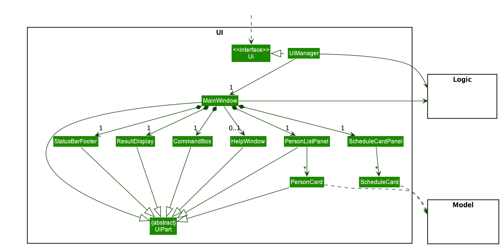

The UI consists of a `MainWindow` that is made up of parts e.g.`CommandBox`, `ResultDisplay`, `PersonListPanel`, `StatusBarFooter` etc. All these, including the `MainWindow`, inherit from the abstract `UiPart` class which captures the commonalities between classes that represent parts of the visible GUI.

The `UI` component uses the JavaFx UI framework. The layout of these UI parts are defined in matching `.fxml` files that are in the `src/main/resources/view` folder. For example, the layout of the [`MainWindow`](https://github.com/se-edu/addressbook-level3/tree/master/src/main/java/seedu/address/ui/MainWindow.java) is specified in [`MainWindow.fxml`](https://github.com/se-edu/addressbook-level3/tree/master/src/main/resources/view/MainWindow.fxml)

The `UI` component,

* executes user commands using the `Logic` component.
* listens for changes to `Model` data so that the UI can be updated with the modified data.
* keeps a reference to the `Logic` component, because the `UI` relies on the `Logic` to execute commands.
* depends on some classes in the `Model` component, as it displays `Person` object residing in the `Model`.

The `Graphical UI` that will be displayed to the users when using `UniGenda` is as follows:

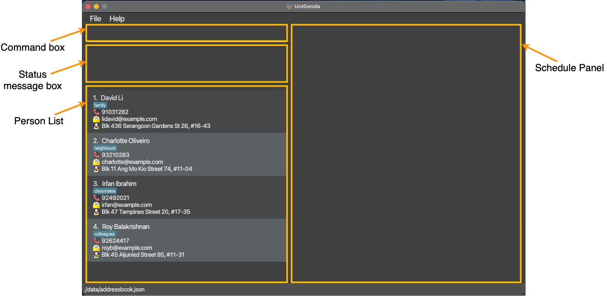

## 3.3 Logic component

**API** : [`Logic.java`](https://github.com/AY2122S2-CS2103T-W09-1/tp/blob/master/src/main/java/seedu/address/logic/Logic.java)

Here's a (partial) class diagram of the `Logic` component:

How the `Logic` component works:
1. When `Logic` is called upon to execute a command, it uses the `AddressBookParser` class to parse the user command.
1. This results in a `Command` object (more precisely, an object of one of its subclasses e.g., `AddCommand`) which is executed by the `LogicManager`.
1. The command can communicate with the `Model` when it is executed (e.g. to add a person).
1. The result of the command execution is encapsulated as a `CommandResult` object which is returned back from `Logic`.

The Sequence Diagram below illustrates the interactions within the `Logic` component for the `execute("delete 1")` API call.

:information_source: **Note:** The lifeline for `DeleteCommandParser` should end at the destroy marker (X) but due to a limitation of PlantUML, the lifeline reaches the end of diagram.

Here are the other classes in `Logic` (omitted from the class diagram above) that are used for parsing a user command:

How the parsing works:
* When called upon to parse a user command, the `AddressBookParser` class creates an `XYZCommandParser` (`XYZ` is a placeholder for the specific command name e.g., `AddCommandParser`) which uses the other classes shown above to parse the user command and create a `XYZCommand` object (e.g., `AddCommand`) which the `AddressBookParser` returns back as a `Command` object.
* All `XYZCommandParser` classes (e.g., `AddCommandParser`, `DeleteCommandParser`, ...) inherit from the `Parser` interface so that they can be treated similarly where possible e.g, during testing.

## 3.4 Model component
**API** : [`Model.java`](https://github.com/AY2122S2-CS2103T-W09-1/tp/blob/master/src/main/java/seedu/address/model/Model.java)

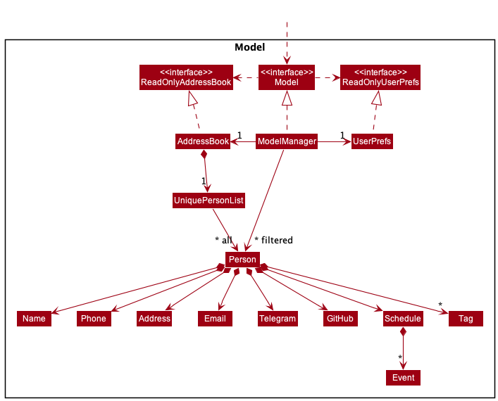

The `Model` component,

* stores the address book data i.e., all `Person` objects along with their `Schedule` and other attributes (which are contained in a `UniquePersonList` object).
* stores the currently 'selected' `Person` objects (e.g., results of a search query) as a separate _filtered_ list which is exposed to outsiders as an unmodifiable `ObservableList<Person>` that can be 'observed' e.g. the UI can be bound to this list so that the UI automatically updates when the data in the list change.
* stores a `UserPref` object that represents the user’s preferences. This is exposed to the outside as a `ReadOnlyUserPref` objects.
* does not depend on any of the other three components (as the `Model` represents data entities of the domain, they should make sense on their own without depending on other components)

## 3.5 Storage component

**API** : [`Storage.java`](https://github.com/AY2122S2-CS2103T-W09-1/tp/blob/master/src/main/java/seedu/address/storage/Storage.java)

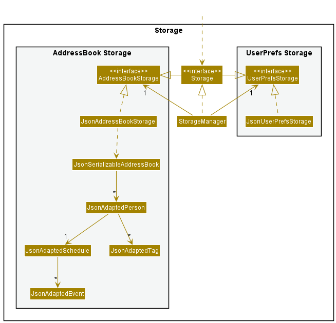

The `Storage` component,
* can save both address book data and user preference data in json format, and read them back into corresponding objects.
* inherits from both `AddressBookStorage` and `UserPrefStorage`, which means it can be treated as either one (if only the functionality of only one is needed).
* depends on some classes in the `Model` component (because the `Storage` component's job is to save/retrieve objects that belong to the `Model`)

## 3.6 Common classes

Classes used by multiple components are in the `seedu.addressbook.commons` package.

--------------------------------------------------------------------------------------------------------------------

# 4. **Implementation Highlights**

This section describes some noteworthy details on how certain features are implemented.

## 4.1 Schedule Feature
This subsection details how `Schedule` and `Event` classes were implemented.

### Implementation
To enable users to track their contacts' schedules, 2 new classes have been added: `Schedule` and `Event`
* Each `Person` has a `Schedule` attribute.
* A `Schedule` contains a list of `Event`s.
* An `Event` has an `EventDescription`, a `LocalDate`, a `LocalTime`, a `Duration` and a `RecurFrequency`.
  * Here, the `RecurFrequency` indicates how often the `Event` occurs, which can be daily, weekly, biweekly or none.

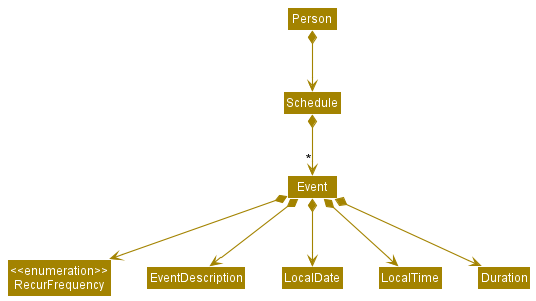

The start date of recurring events are updated upon the start-up of the application, to reflect the next occurrence of the event, if the event has already passed.

### Design considerations
**Aspect: How should we differentiate recurring events and non-recurring events?**
* **Alternative 1 (current choice):** Every `Event` has a `RecurFrequency` attribute. `RecurFrequency` has a `None` value to represent non-recurring tasks.
  * Pros:
    * Easier to implement, no need to deal with Jackson library deciphering whether data should be recurring or non-recurring type.

* **Alternative 2:** Have a `RecurringEvent` class inherit from `Event` and only `RecurringEvent`s should have the `RecurFrequency` attribute.
  * Pros: 
    * Slightly more OOP.
  * Cons:
    * Difficult to implement, increases likelihood of bugs and may take more time to implement should we misunderstand how Jackson library deciphers data.
    * More awkward type checking and casting when checking for recurrence.

**Aspect: How should we implement event's date, time and duration attributes?**
* **Alternative 1 (current choice):** Use Java's in built LocalDate, LocalTime and Duration classes.
  * Pros:
    * Easier to implement, no need to account for leap years, number of days in a month, formatting etc. Also has inbuilt support to calculate time.
* **Alternative 2:** Create our own Date, Time and Duration classes.
  * Pros: 
    * More customisable.
  * Cons:
    * Higher possibility of bugs if we do not properly account for leap years, number of days in a month, formatting etc. Will also take too much time to implement.

## 4.2 WhoIsFree feature
This subsection details how the `whoIsFree` command is implemented. This command allows the user to find persons who are free at the specified time and date. Persons who are free will be listed in the person list.

### Implementation
`WhoIsFreeCommandParser` and `WhoIsFreeCommand` classes are involved in the execution of the `whoIsFree` command.

The `parse` method of `WhoIsFreeCommandParser` receives the user input and extracts the required arguments. It then creates a predicate object that will help check if the user's contacts' schedule coincides with the specified time and date.

A successful execution of the `whoIsFree` command is described as follows:

1. `WhoIsFreeCommand` uses the predicate prepared during parsing to filter the list of persons in `Model`.
2. A `CommandResult` with the number of persons free is returned. A list of persons who are free will also be displayed to the user.

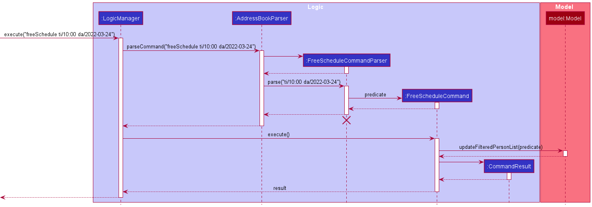

### Design Considerations
**Aspect: Should we allow dates that have already passed?**
* **Alternative 1 (current implementation)**: Ignore dates that have passed.
  * Pros:
    * Prevents users from expecting the wrong results when recurring events are involved.
  * Cons:
    * Harder implementation as we would have to consider all events with respect to today.
* **Alternative 2**: Treat the past dates as a normal dates.
  * Pros:
    * Easy implementation as there is nothing special to take note.
  * Cons:
    * Does not make sense to check dates have already passed.

**Aspect: What to do with persons who do not have a schedule?**
* **Alternative 1 (current implementation)**: Persons without schedule are always free.
  * Pros:
    * Easy implementation.
  * Cons:
    * Persons without schedule may not be free at the specified date and time.
    * We will have to check all persons for their schedule and display all persons.
* **Alternative 2**: Persons without schedule are always busy.
  * Pros:
    * Higher certainty that persons shown will be free.
    * Less information to process as we ignore persons without schedule.
  * Cons:
    * Persons without schedule may be free at the specified date and time.

## 4.3 ViewSchedule Feature

This subsection details how the `viewSchedule` feature is implemented. This command allows user to view a specified person's schedule.

### Implementation

To allow users to view their contact's schedules, we implemented a `ViewScheduleCommand`, and added a `FilteredList<Person>` object in `ModelManager` to facilitate its execution. Moreover, we created `ScheduleCard.java`, `ScheduleCardPanel.java`, and their respective `.fxml` files.

Overall, how this command works is similar to a combination of `delete` and `find`, in which we only take an index as input, and we retrieve information based on the filtered list.

To **view** a person's schedule, the user needs to run the `viewSchedule` command.
The parsing of the viewSchedule command is handled by the following classes:
* `AddressBookParser`
    * Checks that the user input contains the ViewScheduleCommand.COMMAND_WORD and calls `ViewScheduleCommandParser#parse()`.
* `ViewScheduleCommandParser`
    * Parses the user input to create an `Index` of the person to view.
    * Returns a `ViewScheduleCommand` to be executed by the `LogicManager`.
    * In case of invalid index, it will be handled by the `ViewScheduleCommand` upon execution.

A successful execution of the `viewSchedule` command is described as follows:
1. The `ViewScheduleCommand` retrieves the currently listed `Person`'s from the `Model`.
2. The `personToView` is obtained from the above list using the `Index` created during the parsing of the viewSchedule command.
3. `ViewScheduleCommand` creates a new `SamePersonPredicate` that returns `True` only if the tested `Person` equals to `personToView`.
4. `ViewScheduleCommand` updates the `Model`'s `viewedPerson` (the `FilteredList<Person>` object) by parsing in the `SamePersonPredicate`.
5. `ViewScheduleCommand` constructs the `CommandResult` and returns it to the `LogicManager`.
6. The GUI will be updated accordingly.

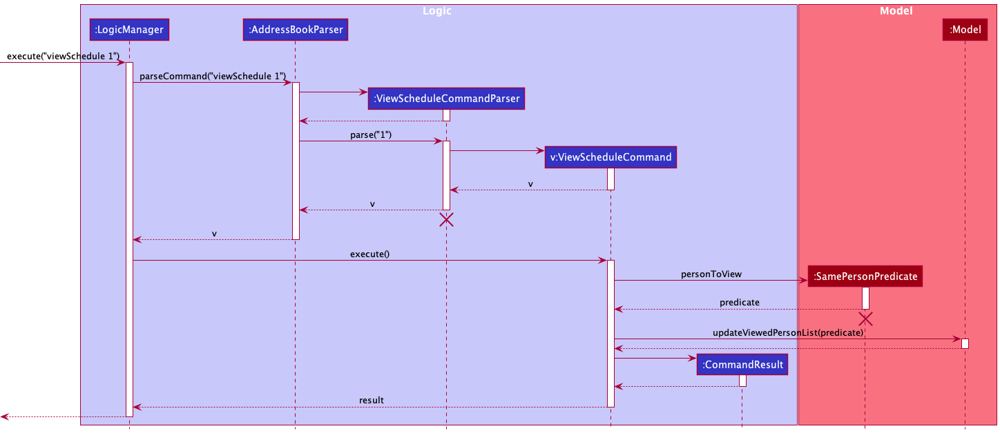

### Design Considerations
**Aspect: Should viewedPerson be a FilteredList or a Person?**
* **Alternative 1 (current choice):** viewedPerson as a FilteredList.
  * Pros:
    * Easier to implement, easier to develop if in the future we want to display more than one Person.
  * Cons:
    * Not intuitive since now the viewSchedule command only support viewing one Person.
* **Alternative 2:** viewedPerson as a Person.
  * Pros:
    * More intuitive because it **is** the displayed Person's Schedule we are interested in.
  * Cons:
    * Can only view one Person at any time, need to change the implementation when developer wants to display more than one Person.

**Aspect: What attributes should be displayed in the schedule panel upon calling viewSchedule?**
* **Alternative 1 (current choice):** Displays Name, Tags, and Schedule; No Schedule on Person List.
  * Pros:
    * Cleaner look of Person List, can display more detailed version of Events.
  * Cons:
    * User doesn't know if a particular Person in the Person List has any Schedule or not.
* **Alternative 2:** All attributes of a Person both on Schedule and Person List.
  * Pros:
    * More detailed version of a Person, so the user doesn't need to look in both panels to get all the information of a Person.
  * Cons:
    * Person List display only fits a few Persons at a time.

## 4.4 ViewGroup Feature
This subsection details how the `viewGroup` command is implemented. This command allows the user to be able to view a list of persons who share the same tag.

### Implementation
`ViewGroupCommandParser` and `ViewGroupCommand` classes are involved in the execution of the `ViewGroup` command.

The `parse` method of `ViewGroupCommandParser` received the user input and extracts the required arguments. It then creates a predicate object that will help check if the contact has the user-inputted tag attached to the contact.

A successful execution of the `viewGroup` command is described as follows:

1. `ViewGroupCommand` uses the predicate prepared during parsing to filter the list of persons in `Model`

2. A `CommandResult` with the number of persons who share the same tag is returned. A list of persons who share the same tag will also be displayed to the user.

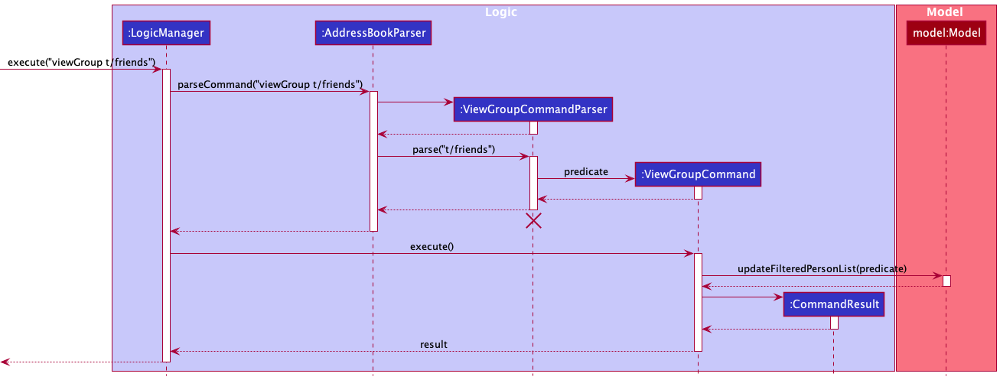

### Design Considerations

**Aspect: What is an attribute of a person that a user would want to filter contacts by?**
* **Alternative 1 (current choice):** Filter by tag
  * Pros: 
    * People who share the same tag are likely to be from the same group of friends, hence a user would be able to view the details or schedule of those persons more easily using such a command.
  * Cons:
    * Not able to filter by another attribute of a person such as whether person has schedule or not.

* **Alternative 2:** Filter by whether person has schedule or not.
  * Pros: 
    * It allows the user to view the contacts whom they have added their schedule to. These persons can be assumed to be closer to the user as the user has added a schedule to them, hence a user is more likely to plan a meetup with such contacts.
  * Cons: 
    * Ultimately, a tag is still the best way for users to distinguish between groups of friends and had this implementation been enforced, users would not have been allowed to filter contacts by tag.

## 4.5 FindCommonTiming Feature
This subsection details how the findCommonTiming feature is implemented. This command allows user to find common timings for a group of persons in their address book.

### Implementation
`FindCommonTimingParser`, `FindCommonTimingCommand` and `IsTagInPersonPredicate` classes are involved in the execution of the `findCommonTiming` command.

The `parse` method of `FindCommonTimingCommandParser` receives the user input and extracts the required arguments. It then creates a predicate object that will help check if the contact has the user-inputted tag attached to the contact. The user-inputted date will be used to retrieve events occuring on the same day such that the free timings can be determined. 

A successful execuction of the `findCommonTiming` command is described as follows:

1. `FindCommonTimingCommand` uses the predicate prepared during parsing to filter the list of persons in `Model`.
2. Events occuring on a certain day are then retrieved using the `getEventsAtDate` function.
3. The day will be represented as an array of 48 time slots, with each element of the array representing a 30-minute timeslot.
4. TheThe `blockTimeSlots` function is used to ensure that respective timeslots are set as busy according to when events occur.
5. Free time slots will be appended to a string that is due to be returned in the `CommandResult`.
6. A `CommandResult` with the timeslots that the persons are free will be returned (timeslots are in intervals of 30 minutes). 
These timeslots will then be displayed to the user.

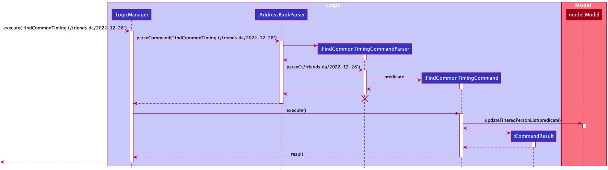

### Design Considerations

**Aspect: How FindCommonTiming executes**
* **Alternative 1(current implementation)**: Partition the day into time blocks in an array. For every event that belongs to a person with the specified tag, get the start and end times of the event and block the relevant time blocks between the 2 timings to indicate that at least 1 person is unavailable during the time blocks. At the end, return the time blocks that have not been blocked.
  * Pros:
    * The method is easier to grasp and has less edge cases that need to be handled.
  * Cons:
    * To print out free timings, a lot of effort is required to ensure timings that are printed out are bug-free.

* **Alternative 2**: Create a new TimeSlot class that has a start time and a duration attribute. Create an array containing 1 TimeSlot object with a start time of 00:00 and duration of 24 hours to represent the day. For every event that belongs to a person with the specified tag, get the start and end times of the event and split the TimeSlot object to "remove" the timeslots in which a person with the specified tag is not free.
    * Pros: 
      * It is a robust solution, which if carried out correctly, would result in there being minimal effort in printing out the blocks of free time available.
    * Cons:
      * There are a number of edge cases to handle of high complexity due to overlapping timings between different contacts.
      
**Aspect: What partition size should we use?**
* **Alternative 1 (current implementation)**: Show common free timings in 30-minute blocks.
  * Pros:
    * More efficient implementation as 30-minute intervals would be ruled out as compared to 1-minute intervals
    * More easily understood by users who are likely to plan meetings in 30-minute intervals
  * Cons:
    * More meticulous planners will lament a lack of an ability to include intervals of less than 30 minutes.
* **Alternative 2**: Show common free timings accurate to the minute
  * Pros:
    * Feature would work for even the most meticulous of planners and could perhaps increase the benefit of the feature marginally
  * Cons:
    * Efficiency of implementation would be compromised to cater to a smaller target group.

## 4.6 ImportSchedule and ExportSchedule Features
This subsection details how the `importSchedule` and `exportSchedule` commands are implemented. This command allows the user to import and export the schedule of persons in UniGenda.

### Implementation
`ImportScheduleCommandParser` and `ImportScheduleCommand` classes are involved in the execution of the `importSchedule` command. While `ExportScheduleCommandParser` and `ExportScheduleCommand` classes are involved in the execution of the `exportSchedule` command. The `JsonUtil` and `JsonAdaptedSchedule` classes were also used to read and save the files during import and export.

The `parse` method of `ImportScheduleCommandParser` and `ExportScheduleCommandParser` receive the user input and extracts the required arguments.

A success execution of the `importSchedule` command is described as follows:

1. `ImportScheduleCommand` retrieves the `Person` from the `Model`, then reads using the `JsonUtil#readJsonFile` method.
2. `JsonAdaptedSchedule` is used to convert the information in the file into a `Schedule`.
3. The imported `Schedule` replaces the existing `Schedule` the `Person` had.
4. A `CommandResult` object indicating that the `importSchedule` command is successful will be created.
   
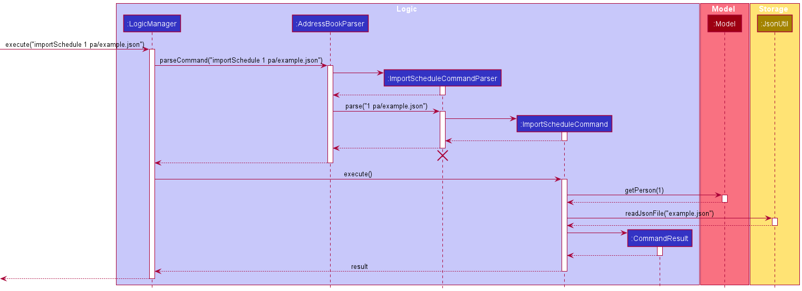

A success execution of the `exportSchedule` command is described as follows:

1. `ExportScheduleCommand` retrieves the `Person` form the `Model`.
2. `Schedule` of the `Person` is retrieved from the `Person`.
3. The `Schedule` is then saved on local memory using the `JsonUtil#saveJsonFile` method.
4. A `CommandResult` object indicating that the `exportSchedule` command is successful will be created.

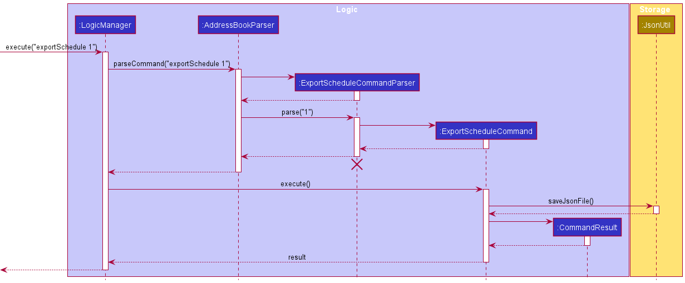

### Design Considerations
**Aspect: What should we do existing schedules when importing?**
* **Alternative 1 (current implementation)**: We replace the existing schedule with the one that we imported.
  * Pros:
    * Easy implementation.
  * Cons:
    * User will lose existing schedule.
* **Alternative 2**: We merge existing schedule with the schedule we imported.
  * Pros:
    * User get to keep all old and new schedules.
  * Cons:
    * Harder to implement, requires a lot of checks like whether the imported schedule contains events that were already in the existing schedule.
    * Implementation might incur some wait time if there are many events that are being checked and added.

**Aspect: Where should we save the exported files?**
* **Alternative 1**: Users specify where they want files to be saved.
  * Pros:
    * Users will be able to save wherever they like.
  * Cons:
    * Harder to implement as we would have to check if the file path given is an absolute path or a relative path.
* **Alternative 2 (current implementation)**: We save the files in the data folder.
  * Pros:
    * Location for exported files will not change.
    * Location for exported files will not change.
    * Do not have to check if the file path is an absolute path or a relative path.
  * Cons:
    * Users will not be able to save the files where they like.

--------------------------------------------------------------------------------------------------------------------

# 5. **Documentation, logging, testing, configuration, dev-ops**

* [Documentation guide](Documentation.md)
* [Testing guide](Testing.md)
* [Logging guide](Logging.md)
* [Configuration guide](Configuration.md)
* [DevOps guide](DevOps.md)

--------------------------------------------------------------------------------------------------------------------

# 6. **Appendix A: Requirements**

## 6.1 Product scope

**Target user profile**:

* University students who have trouble keeping track of their own schedules
* Has university friends and/or project group mates with similarly packed schedules
* Find it difficult to synchronise their schedules with their friends to meet
* Need to plan project meetings often, but face difficulty scheduling a common time to meet
* prefer desktop apps over other types
* can type fast and prefers typing to mouse interactions
* is reasonably comfortable using CLI apps

**Value proposition**: 

Problem:
With COVID causing home based learning to become the norm, meeting up with friends or project group mates in person has become a rarity for university students. It has also increased the need to schedule online meetings. But with everyone's tightly packed schedules, it is difficult to find that common time to meet or find friends who are free at particular dates and times!

How UniGenda solves the problem:
UniGenda improves the ease of finding common meeting times with contacts by allowing users to keep track of not only their own, but also their friends or project group mates' schedules!

## 6.2 User stories

Priorities: High (must have) - `* * *`, Medium (nice to have) - `* *`, Low (unlikely to have) - `*`

| Priority | As a …​                                     | I want to be able to…​                                                | So that I can…​                                                        |
|----------|---------------------------------------------|-----------------------------------------------------------------------|------------------------------------------------------------------------|
| `* * *`  | new user                                    | see usage instructions                                                | I can learn how to use the app                                         |
| `* * *`  | user                                        | add a new person into my contacts                                     |                                                                        |
| `* * *`  | user                                        | edit a person's details                                               | update my contacts' information                                        |
| `* * *`  | user                                        | delete a person in my contacts                                        | remove entries that I no longer need                                   |
| `* * *`  | user                                        | add an event to my contact's schedule                                 | refer to the contact's schedule on a later date                        |
| `* * *`  | user                                        | edit an event on a person's schedule                                  | amend changes to my contact's schedule                                 |
| `* * *`  | user                                        | delete an event on a person's schedule                                | remove events that are no longer in my contact's schedule              |
| `* * *`  | user                                        | view my contact's schedule                                            |                                                                        |
| `* * *`  | university student                          | add recurring events such as weekly tutorials and labs to my schedule | avoid having to add a new event every week                             |
| `* *`    | user looking for friends to hang out with   | see who are available at a particular date and time                   | easily find a friend to meet up with                                   |
| `* *`    | university student planning a group meeting | see which timings all my project group mates are free                 | plan the meeting more efficiently                                      |
| `* *`    | user                                        | import my friends' schedules                                          | view their schedules without needing to add their events 1 by 1        |
| `* *`    | university student                          | filter my contacts by modules they are taking with me                 | so that I can discuss module assignments with them                     |
| `* *`    | user                                        | view my schedule easily                                               |                                                                        |
| `* *`    | user                                        | clear a contact's schedule easily                                     |
| `* *`    | user                                        | clear my application data easily                                      |
| `*`      | user                                        | find a person by name                                                 | locate details of persons without having to go through the entire list |

## 6.3 Use cases

(For all use cases below, the **System** is the `UniGenda` and the **Actor** is the `user`, unless specified otherwise)

**Use case: Delete a person**

**MSS**

1.  User requests to list persons
2.  UniGenda shows a list of persons
3.  User requests to delete a specific person in the list
4.  UniGenda deletes the person

    Use case ends.

**Extensions**

* 2a. The list is empty.

  Use case ends.

* 3a. The given index is invalid.

  * 3a1. UniGenda shows an error message.

    Use case resumes at step 2.

**Use case: Add an event**

**MSS**

1. User requests to add an event to a specific person's schedule
2. UniGenda adds an event to the person's schedule

    Use case ends.

**Extensions**

* 1a. The specified date, time or duration of the event is invalid.

  * 1a1. UniGenda shows an error message.

    Use case ends.

* 1b. The user does not specify an event description or date.

  * 1b1. UniGenda shows an error message.

    Use case ends.

* 1c. The user specifies a duration for the event without specifying the start time.

  * 1c1. UniGenda shows an error message.

    Use case ends.

* 1d. The given index is invalid.

  * 1d1. UniGenda shows an error message.

    Use case ends.

**Use case: Edit an event**

**MSS**

1. User requests to edit a specific event on a specific person's schedule
2. UniGenda edits the event

   Use case ends.

**Extensions**

* 1a. The specified date, time or duration of the event, if any, is invalid.

  * 1a1. UniGenda shows an error message.

    Use case ends.

* 1b. The user edits an event's duration without specifying a start time (if the event does not already have one).

  * 1b1. UniGenda shows an error message.

    Use case ends.

* 1c. The specified contact index or event index is invalid.

  * 1c1. UniGenda shows an error message.

    Use case ends.

**Use case: Delete an event**

**MSS**

1. User requests to delete a specific event on a specific person's schedule.
2. UniGenda deletes the event.

    Use case ends.

**Extensions**

* 1a. The specified contact index or event index is invalid.

  * 1a1. UniGenda shows an error message.

    Use case ends.

**Use case: Clear a person's schedule**

**MSS**

1. User requests to clear a specified person's schedule.
2. UniGenda clears the person's schedule.

    Use case ends.

**Extensions**

* 1a. The specified contact index is invalid.

    * 1a1. UniGenda shows an error message.

      Use case ends.

**Use case: View a person's schedule**

**MSS**

1. User requests to view a specific person's schedule.
2. UniGenda displays the person's schedule.

    Use case ends.

**Extensions**

* 1a. The specified contact index is invalid.

  * 1a1. UniGenda shows an error message.

    Use case ends.

**Use case: Find who is free**

**MSS**

1. User inputs time and date to find who is free.
2. UniGenda displays contacts who are free at the date and time.

    Use case ends.

Extensions
* 1a. The specified date or time is invalid.

  * 1a1. UniGenda shows an error message.

    Use case ends.

**Use case: Import schedule**

**MSS**

1. User imports schedule for a specific person.
2. UniGenda replaces the schedule with the imported schedule.

   Use case ends.

**Extensions**
* 1a. The specified contact index is invalid.

  * 1a1. UniGenda shows an error message.

    Use case ends.

* 1b. The specified file path in invalid or unreachable.

  * 1b1. UniGenda shows an error message.

    Use case ends.

* 2a. The file information is in the wrong format.

  * 2a1. UniGenda shows an error message.
  * 2a2. If app can save file, UniGenda creates a template file for user reference.
  * 2a3. If app cannot save the file, UniGenda shows an example in the display box.

    Use case ends.

**Use case: Export schedule**

**MSS**

1. User chooses a person's schedule to export.
2. UniGenda exports the person's schedule.

    Use case ends.

**Extensions**
* 1a. The specified contact index is invalid.

  * 1a1. UniGenda shows an error message.

    Use case ends.

* 2a. The specified contact does not have a schedule.

  * 2a1. UniGenda shows an error message.

    Use case ends.

* 3a. UniGenda is unable to save the file to local storage.

  * 3a1. UniGenda shows an error message.

  Use case ends.

**Use case: View contacts by tag**

**MSS**

1. User requests to view only contacts who have the specified tag.
2. UniGenda shows the list of contacts who have the specified tag.

   Use case ends.

**Extensions**
* 1a. There are no users with the specified tag.

  * 1a1. UniGenda shows an error messaage.

    Use case ends.
    
**Use case: Display timings contacts that share a tag are free on a particular day**

**MSS**

1. User requests to list persons.
2. User chooses to view the free timings of a group of contacts who share a similar tag, on a particular day.
3. UniGenda shows the timings the contacts are free.

**Extensions**
* 1a. The given tag is not attached to any contact in UniGenda.
    
    * 1a1. UniGenda shows an error message.
  
    Use case ends.

* 2a. The contacts which share the given tag do not have any events scheduled on the given date.

    * 2a1. UniGenda shows the user a message which indicates that the whole day is free for contacts who share the inputted tag.
    
    Use case ends.
    
* 3a. The given date is invalid.
  
    * 3a1. UniGenda shows an error message.

    Use case ends.

## 6.4 Non-Functional Requirements

1. Should work on any _mainstream OS_ as long as it has Java `11` or above installed.
2. Should be able to hold up to 100 persons without a noticeable sluggishness in performance for typical usage.
3. A user with above average typing speed for regular English text (i.e. not code, not system admin commands) should be able to accomplish most of the tasks faster using commands than using the mouse.
4. Should be able to hold up to 1000 events across all persons without noticeable lag.
5. Data should be stored locally and not use any database management system.
6. The application should work with a single JAR file, and should work without requiring an installer.
7. The application size should not exceed `100MB`.

## 6.5 Glossary

* **Mainstream OS**: Windows, Linux, Unix, OS-X
* **Event**: Something that happens
* **Schedule**: A list of Events
* **Person(s)**: The contact(s) of `UniGenda`. Contact and Person could be used interchangeably, but they refer to the same thing
* **Main Success Scenario (MSS)**: Describes the most straightforward interaction for a given use case, which assumes that nothing goes wrong
* **Command Line Interface (CLI)**: Text-based user interface
* **Graphical User Interface (GUI)**: Graphic-based user interface

--------------------------------------------------------------------------------------------------------------------

# 7. **Appendix B: Instructions for Manual Testing**

Given below are instructions to test the app manually.

:information_source: **Note:** These instructions only provide a starting point for testers to work on;
testers are expected to do more *exploratory* testing.

## 7.1 Launch and shutdown

1. Initial launch

   1. Download the jar file and copy into an empty folder.

   2. Double-click the jar file Expected: Shows the GUI with a set of sample contacts.

## 7.2 Adding a person

1. Adding a person to `UniGenda`

    1. Prerequisites: No person named John Doe or Jane Doe in `UniGenda`.
   
    2. Test case: `add n/John Doe p/98765432`  
       Expected: A new person with name John Doe and phone number 98765432 is added to `UniGenda`. Detail of the newly added person is shown in the status message.

    3. Test case: `add n/Jane Doe p/12345678 e/janed@example.com tg/JaneDoe gh/DoeJane`  
       Expected: A new person with name Jane Doe, phone number 12345678, email janed@example.com, telegram JaneDoe, github DoeJane is added to `UniGenda`. Detail of the newly added person is shown in the status message.

    4. Test case: `add n/John`  
       Expected: No person is added. Error detail is shown in the status message.

    5. Other incorrect add commands to try: `add`, `add 1`  
       Expected: Similar to previous.

## 7.3 Deleting a person

1. Deleting a person while all persons are being shown

    1. Prerequisites: List all persons using the `list` command. Multiple persons in the list.

    2. Test case: `delete 1` 
       Expected: First person is deleted from the list. Detail of the deleted person is shown in the status message.

    3. Test case: `delete 0` 
       Expected: No person is deleted. Error detail is shown in the status message.

    4. Other incorrect delete commands to try: `delete`, `delete x`, `...` (where x is larger than the list size) 
       Expected: Similar to previous.

## 7.4 Editing a person

1. Editing an existing person in `UniGenda` while all persons are being shown

    1. Prerequisites: List all persons using the `list` command. Multiple persons in the list.

    2. Test case: `edit 1 p/91234567 e/johndoe@example.com`  
       Expected: The first person in the list will have phone number 91234567 and email johndoe@example.com. Detail of the edited person is shown in the status message.

    3. Test case: `edit 1 a/ e/ tg/ gh/`  
       Expected: The first person in the list will no longer have address, email, telegram, or github recorded. Detail of the edited person is shown in the status message.

    4. Test case: `edit 1`  
       Expected: Nothing edited. Error detail is shown in the status message.
    
    5. Other incorrect edit commands to try: `edit`, `edit 0`  
       Expected: Similar to previous.

## 7.5 Setting a person as the user

1. Setting a person on `UniGenda` as the user while all persons are being shown

    1. Prerequisities: List all persons using the `list` command. More than one persons in the list.

    2. Test case: `setUser 2`  
       Expected: The second person in the list "becomes" the user and that person's card moves to the top of the list. Name of the new user is shown in the status message.
    
    3. Test case: `setUser 0`  
       Expected: No changes in the list. Error detail is shown in the status message.

    4. Other incorrect setUser commands to try: `setUser`, `setUser x` (where x is larger than the list size)  
       Expected: Similar to previous.

## 7.6 Viewing persons that share the same tag

1.  Viewing all contacts that share the same tag

    1. Prerequisities: List all persons using the `list` command. More than one person in the list. 
        Ensure that at least one of the contacts have the tag "friends" attached to them. 
        Ensure that none of the persons have the tag "mates" attached to them.
    
    2. Test case: `viewGroup t/friends`
       Expected: All persons who have the tag "friends" will be listed in the addressbook.
       
    3. Test case: `viewGroup t/`
       Expected: Error message shown that tag cannot be empty, along with other restrictions on tag name.
    
    4. Test case: `viewGroup t/mates` (i.e. a tag that is not attached to any contact)
       Expected: Error message shown that tag is not assigned to any contact.

## 7.7 Adding an event

1. Adding an event to a person while all persons are being shown

    1. Prerequisites: List all persons using the `list` command. Multiple persons in the list. All contacts do not have any schedule.

    2. Test case: `addEvent 1 ed/CS2103T Tutorial da/2022-12-28 ti/10:00 du/3H30M r/W`  
       Expected: The first person's schedule (with the inputted event included) will be displayed in the schedule panel. The newly added event detail is shown in the status message. 

    3. Test case: `addEvent 0 ed/CS2103T Tutorial da/2022-12-28 ti/10:00 du/3H30M r/W`  
       Expected: No change in the GUI. Error detail is shown in the status message.

    4. Other incorrect addEvent commands to try: `addEvent`, `addEvent 0`  
       Expected: Similar to previous.

## 7.8 Deleting an event

1. Deleting a person's event while all persons are being shown

    1. Prerequisites: List all persons using the `list` command. Multiple persons in the list. The first person in the list should have a non-empty. (To add an event to the first person's schedule if empty, use this command `addEvent 1 ed/CS2103T Tutorial da/2022-12-28 ti/10:00 du/3H30M r/W`)

    2. Test case: `deleteEvent 1 1`  
       Expected: The first person's schedule will be displayed in the schedule panel. The first event in the person's schedule will be deleted. The name of the person whose event deleted and the index of the event are shown in the status message.

    3. Test case: `deleteEvent 1 0`  
       Expected: No change in the GUI. Error detail is shown in the status message.

    4. Other incorrect deleteEvent commands to try: `deleteEvent`, `deleteEvent 1`  
       Expected: Similar to previous.

## 7.9 Editing an event

1. Editing an existing person's event while all persons are being shown

    1. Prerequisites: List all persons using the `list` command. Multiple persons in the list. All contacts do not have any schedule initially. Type in this command `addEvent 1 ed/CS2103T Tutorial da/2022-12-28 ti/10:00 du/3H30M r/W`. The first person's schedule will be displayed on the schedule panel.

    2. Test case: `editEvent 1 1 ti/11:00`  
       Expected: The event in the person's schedule will be edited so that it starts at 11:00 instead of 10:00. The edited event detail is shown in the status message.

    3. Test case: `editEvent 1 1 ed/CS2102 Tutorial`  
       Expected: The event in the person's schedule will be edited so that its event description is CS2102 Tutorial instead of CS2103T Tutorial. The edited event detail is shown in the status message.
    
    4. Test case: `editEvent 1 1 da/2022-12-30 du/2H`  
       Expected: The event in the person's schedule will be edited so that its starting date is 2022-12-30, and the event lasts for 2 hours, instead of starting at 2022-12-28 and lasts for 3 hours and 30 minutes. The edited event detail is shown in the status message.

    5. Test case: `editEvent 1 1 da/2022-12-30 du/2H`  
       Expected: No change in the GUI. Error detail is shown in the status message.

    6. Other incorrect editEvent commands to try: `editEvent`, `editEvent 1 1`  
       Expected: Similar to previous.

## 7.10 Clearing a person's schedule

1. Clearing a person's schedule and deleting every event recorded to that person

    1. Some person in the list. The first person in the list should have a non-empty schedule. (To add an event to the first person's schedule if empty, use this command `addEvent 1 ed/CS2103T Tutorial da/2022-12-28 ti/10:00 du/3H30M r/W`)

    2. Test case: `clearSchedule 1`  
       Expected: The first person's schedule will be displayed (now empty) in the schedule panel. The name of the person whose schedule cleared is shown in the status message.

    3. Test case: `clearSchedule 0`  
       Expected: No change in the GUI. Error detail is shown in the status message.

    4. Other incorrect clearSchedule commands to try: `clearSchedule`, `clearSchedule x` (where x is larger than the list size)  
       Expected: Similar to previous.

## 7.11 Importing a person's schedule from a JSON file

1. Importing a schedule from an accessible, readable json file

   1. Prerequisites: There should be at least 1 person currently listed in the person list.
   
   2. Test case: `importSchedule 1 pa/<filepath>` 
      Expected: The first person shown in the contact list will have his/her schedule replaced with the schedule data specified in the file in <filepath>.
   
2. Importing a schedule from an invalid file path, or file path is not accessible or not readable
   1. Test case: `importSchedule 1 pa/<invalid_filepath>` 
      Expected: First person's schedule is unchanged. An error message detailing the issue will be displayed to the tester.

3. Importing a schedule with invalid data and/or headers
   1. Test case: `importSchedule 1 pa/<filepath_invalid_data>`
      Expected:  First person's schedule is unchanged. An error message detailing the issue will be displayed to the tester.

## 7.12 Exporting a person's schedule to a JSON file

1. Exporting a person's schedule

   1. Prerequisites: There is at least 1 person in the list. 
        The person has at least 1 event in schedule.

   2. Test case: `exportSchedule 1` 
      Expected: The schedule of the first person will be exported to `data/export/` with `<name>.json` as the file name.

2. Attempting to export a person with empty schedule

   1. Prerequisites: There is at least 1 person in the list.
        The person does not have any event in schedule.
   
   2. Test case: `exportSchedule 1` 
      Expected: An empty schedule message error will be displayed.

3. Exporting with invalid index

   1. Prerequisite: There are no more than 10 person in the list.
   
   2. Test case: `exportSchedule 11`

## 7.13 Displaying a person's schedule

1. Viewing a person's upcoming schedule and full schedule while all persons are being shown

    1. Prerequisites: List all persons using the `list` command. Multiple persons in the list.

    2. Test case: `viewSchedule 1` 
       Expected: First person's schedule is shown in the schedule panel. The name of the first person is shown in the status message.

    3. Test case: `viewSchedule 0` 
       Expected: No change in the GUI. Error detail is shown in the status message.

    4. Other incorrect viewSchedule commands to try: `viewSchedule`, `viewSchedule x` (where x is larger than the list size)  
       Expected: Similar to previous.

## 7.14 Getting persons who are free at specified time and date

1. Finding persons who are free at specified time

   1. Prerequisite: All persons do not have a schedule
   
   2. Test case: `whoIsFree ti/10:00`
       Expected: Same result as previous.

2. Find person who are free at specified time and date

   1. Prerequisites: All contacts are free at 10am on 2022-04-10.
        Some contacts are free at 12pm on 2022-04-20.
        No contacts are free at 8am on 2022-05-10.
   
   2. Test case: `whoIsFree ti/10:00 da/2022-04-10` 
      Expected: Displays all persons.
   
   3. Test case: `whoIsFree ti/12:00 da/2022-04-20` 
      Expected: Contacts who free at 12pm on 2022-04-20 are displayed.

   4. Test case: `whoIsFree ti/10:00` 
      Expected: No contacts displayed.

3. Find person who are free at specified time and date with tag filter

   1. Prerequisites: There is at least 1 person with `friend` as one of their tags.
        Persons with `friend` tag are free at 8pm everyday.
   
   2. Test case: `whoIsFree ti/20:00 t/friend` 
      Expected: All persons with `friend` tag will be displayed.
   
4. Incorrect input given by user

   1. Test case: `whoIsFree ti/1000`  
      Expected: Nothing happens. Error detail is shown in the status message.
   
   2. Test case: `whoIsFree ti/10:00 da/01 Dec 2022`  
      Expected: Same result as previous.
   
   3. Test case: `whoIsFree ti/10:00 da/2022-12-01 t/` 
      Expected: Nothing happens. Error regarding empty tag is displayed.

## 7.15 Getting common timing that everyone who shares the specified tag available at a particular date

1. Listing out times that contacts that share the same tag are free for a particular day
    
    1. Prerequisites: List all persons using the `list` command. Multiple persons in the list. 
        Ensure that there are at least two contacts that share a similar tag called "friends". 
        Ensure that at least two contacts sharing the tag "friends" have an event occurring on 2022-12-28. 
        Ensure that no event is scheduled to occur on 2022-12-29 for the contacts sharing the tag "friends".
        Ensure there is no contact with the tag "mates".
    
    2. Test case: findCommonTiming t/friends da/2022-12-28
       Expected: Timings that these contacts are free will be shown in 30-minute blocks.(i.e the timings that the contacts do not have any event scheduled)
       
    3. Test case: findCommonTiming t/ da/2022-12-28
       Expected: Error message is shown informing user that tag cannot be empty, along with other restrictions on tag name.
    
    4. Test case: findCommonTiming t/friends da/2022-12-29
       Expected: A message that the whole day is free for contacts who share that particular tag is displayed to the user.
       
    5. Test case: findCommonTiming t/mates da/2022-12-28
       Expected: An error message  asking the user to ensure that at least one contact with the tag is present is displayed to the user.

## 7.16 Saving data

1. Dealing with missing/corrupted data files
    1. If the data files are corrupted, `UniGenda` will start with an empty data file, and the corrupted files will be overlapped with the blank file.
