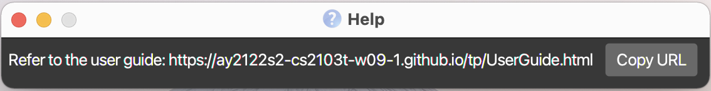
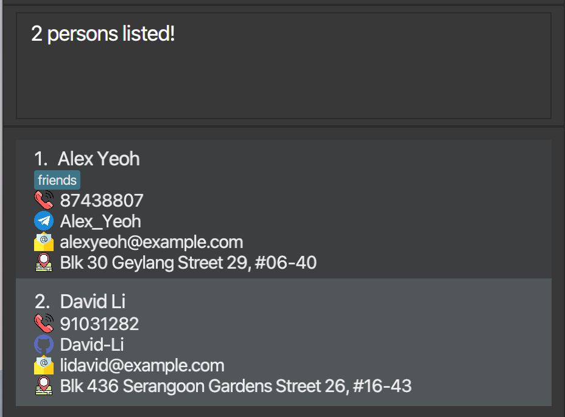
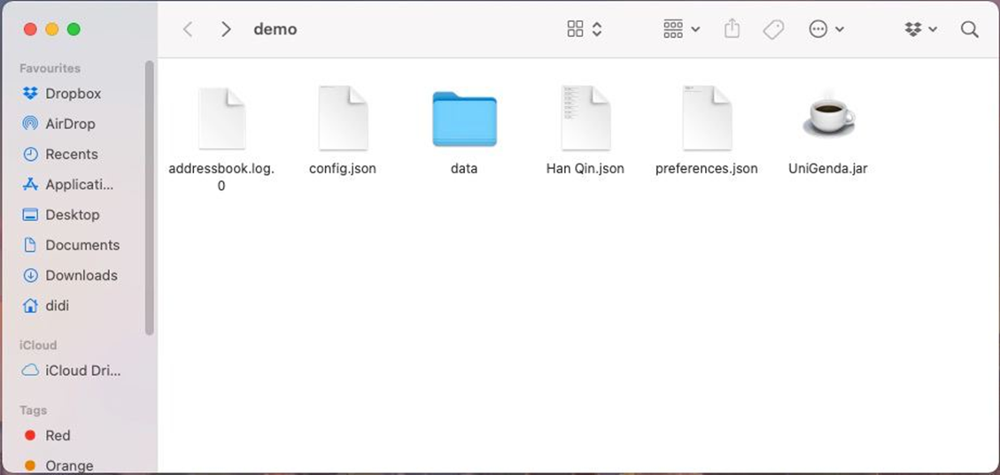
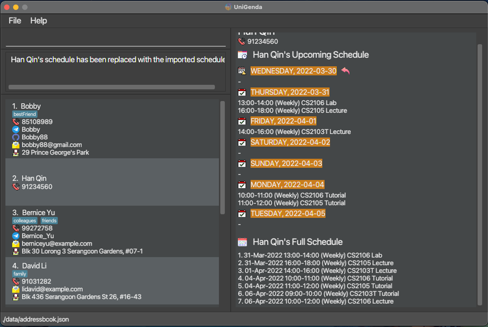
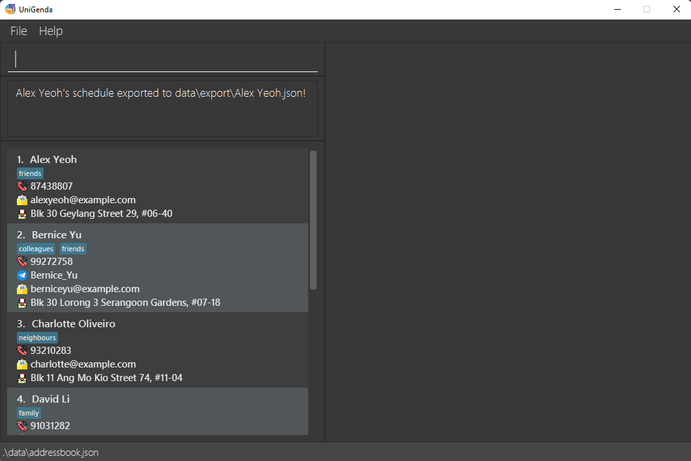
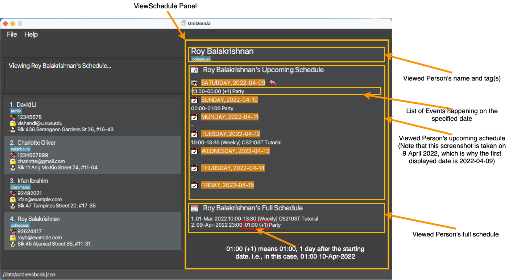
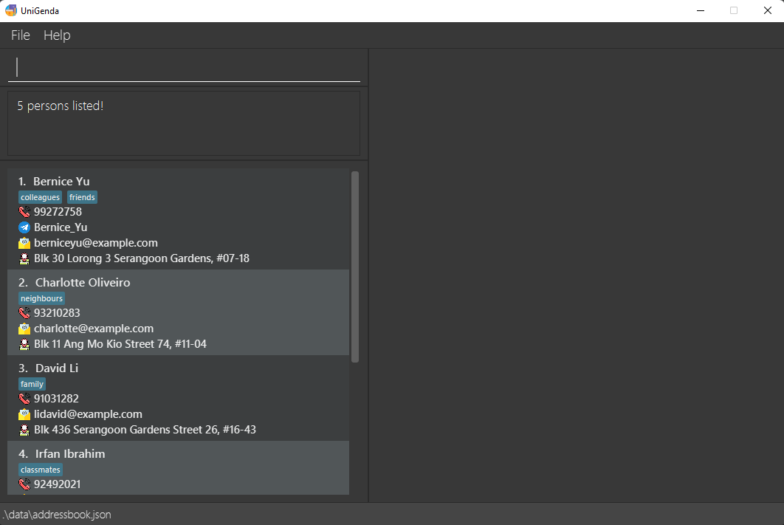
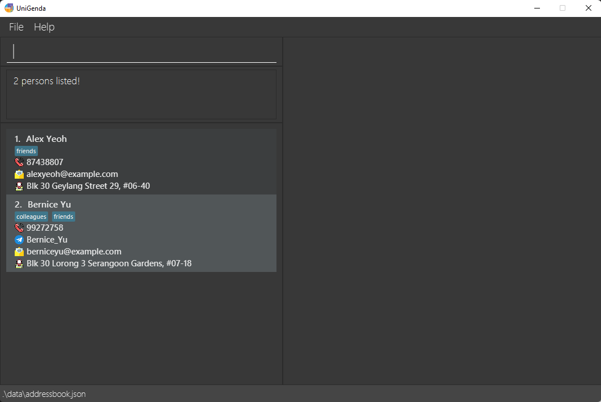

UniGenda is a **desktop app for managing contacts and schedules**, optimized for use via a Command Line Interface (CLI) while still having the benefits of a Graphical User Interface (GUI). If you are a university student having a hard time organising your timetable, or find difficulty scheduling a suitable time to meet up with your project group mates or friends, UniGenda is the app just for you!

With features such as the ability to import your friends' schedules, find friends who are free at a certain date and time, and find common timings to meet with your project teammates, UniGenda makes your university life easier by helping you **keep track of not only your own, but also your friends' schedules!**

# Table of Contents
1. [Quick Start](#1-quick-start)
2. [General Commands](#2-general-commands)
   1. [Help](#21-viewing-help--help)
   2. [Clearing all entries](#22-clearing-all-entries--clear)
   3. [Listing all persons](#23-listing-all-persons--list)
   4. [Exiting the program](#24-exiting-the-program--exit)
3. [Contact Management Commands](#3-contact-management-commands)
   1. [Adding a person](#31-adding-a-person-add)
   2. [Deleting a person](#32-deleting-a-person--delete)
   3. [Editing a person](#33-editing-a-person--edit)
   4. [Setting a person as the user](#34-setting-a-person-as-the-user--setuser)
   5. [Locating persons by name](#35-locating-persons-by-name-find)
   6. [Viewing persons by tags](#36-viewing-persons-by-tags-viewgroup)
4. [Schedule Management Commands](#4-schedule-management-commands)
   1. [Adding an event to a person's schedule](#41-adding-an-event-to-a-persons-schedule-addevent)
   2. [Deleting an event in a person's schedule](#42-deleting-an-event-from-a-persons-schedule-deleteevent)
   3. [Editing an event in a person's schedule](#43-editing-an-event-in-a-persons-schedule-editevent)
   4. [Clearing a person's schedule](#44-clearing-a-persons-schedule-clearschedule)
   5. [Importing a person's schedule](#45-importing-a-persons-schedule-importschedule)
   6. [Exporting a person's schedule](#46-exporting-a-persons-schedule-exportschedule)
   7. [Viewing a person's schedule](#47-viewing-a-persons-schedule--viewschedule)
   8. [Getting persons who are free](#48-getting-persons-who-are-free-whoisfree)
   9. [Getting common free timings of persons by tag](#49-getting-common-free-timing-of-persons-by-tag-findcommontiming)
5. [FAQ](#5-faq)
6. [Command Summary](#6-command-summary)

--------------------------------------------------------------------------------------------------------------------

## 1. Quick Start

1. Ensure you have Java `11` or above installed in your Computer.

2. Download the latest `UniGenda.jar` from [here](https://github.com/AY2122S2-CS2103T-W09-1/tp/releases)*.

3. Copy the file to the folder you want to use as the _home folder_ for your UniGenda.

4. Double-click the file to start the app. The GUI similar to the below should appear in a few seconds. Also note the name for each section of the UI, as it will be referenced throughout the User Guide. 
   

5. Type the command in the command box and press Enter to execute it. e.g. typing **`help`** and pressing Enter will open the help window. 
   Some example commands you can try:

   * **`list`** : Lists all persons in `UniGenda`.

   * **`add`**`n/John Doe p/98765432 e/johnd@example.com a/John street, block 123, #01-01` : Adds a person named `John Doe` to UniGenda.

   * **`delete`**`3` : Deletes the 3rd person shown in the current person list.

   * **`addEvent`**`1 ed/CS2103T Tutorial da/2022-03-16 ti/10:00 du/1` : Adds a CS2103T Tutorial event to the first person.

   * **`exit`** : Exits the app.

   
Refer below for details of each command.

--------------------------------------------------------------------------------------------------------------------

**:information_source: Notes about the command format:** 

* Words in `UPPER_CASE` are the parameters to be supplied by the user. 
  e.g. in `add n/NAME`, `NAME` is a parameter which can be used as `add n/John Doe`.

* Items in square brackets are optional. 
  e.g. `n/NAME [t/TAG]` can be used as `n/John Doe t/friend` or as `n/John Doe`.

* Items with `…`​ after them can be used multiple times including zero times. 
  e.g. `[t/TAG]…​` can be used as ` ` (i.e. 0 times), `t/friend`, `t/friend t/family` etc.

* Parameters can be in any order. 
  e.g. if the command specifies `n/NAME p/PHONE_NUMBER`, `p/PHONE_NUMBER n/NAME` is also acceptable.

* If a parameter is expected only once in the command, but you specified it multiple times, only the last occurrence of the parameter will be taken. 
  e.g. if you specify `p/12341234 p/56785678`, only `p/56785678` will be taken.

* Extraneous parameters for commands that do not take in parameters (such as `help`, `list`, `exit` and `clear`) will be ignored. 
  e.g. if the command specifies `help 123`, it will be interpreted as `help`.

* All leading and trailing whitespaces will be trimmed for each input to each prefix.

* All commands are case-insensitive. For example `addevent` or `AdDEvenT` works for `addEvent` commands.

* The indices, i.e., INDEX and EVENT_NUMBER are integer based. Hence, the maximum value of an index is 2147483647.

## 2. General Commands

### 2.1 Viewing help : `help`

Shows a message explaining how to access the help page.

Format: `help`

### 2.2 Clearing all entries : `clear`

Clears all entries from UniGenda.

Format: `clear`

### 2.3 Listing all persons : `list`

Lists all persons in UniGenda.

Format: `list`

### 2.4 Exiting the program : `exit`

Exits UniGenda.

Format: `exit`

## 3. Contact Management Commands

### 3.1 Adding a person: `add`

Adds a person to UniGenda.

Format: `add n/NAME p/PHONE_NUMBER [tg/TELEGRAM] [gh/GITHUB] [e/EMAIL] [a/ADDRESS] [t/TAG]...`

* `TAG` is case-insensitive (`BestFriend` and `bestFriend` will be considered the same tag) and will be converted to the lowercase for display. Duplicate tags will be ignored and only one will be taken.
* You cannot add duplicate persons. Persons are considered to be duplicates if they share the same name (case-insensitive) and phone number.

Examples:
* add n/John Doe p/98765432
* add n/Betsy Crow t/friend p/1234567 a/Newgate Prison t/Criminal

### 3.2 Deleting a person : `delete`

Deletes the specified person from UniGenda.

Format: `delete INDEX`

* Deletes the person at the specified `INDEX`. The index refers to the index number shown in the displayed person list. The index **must be a positive integer** 1, 2, 3, …​

Examples:
* `list` followed by `delete 2` deletes the 2nd person in UniGenda
* `find Betsy` followed by `delete 1` deletes the 1st person in the results of the `find` command

### 3.3 Editing a person : `edit`

Edits an existing person in the UniGenda.

Format: `edit INDEX [n/NAME] [p/PHONE_NUMBER] [tg/TELEGRAM] [gh/GITHUB] [e/EMAIL] [a/ADDRESS] [t/TAG]...`

* Edits the person at the specified `INDEX`. The index refers to the index number shown in the displayed person list. The index **must be a positive integer** 1, 2, 3, …​
* At least one of the optional fields must be provided.
* Existing values will be updated to the input values.
* When editing tags, the existing tags of the person will be removed, i.e., adding of tags is not cumulative.
* You can remove all the person’s tags by typing `t/` without specifying any tags after it.
* You can also remove telegram, github, email, or address by typing its corresponding prefix without specifying anything after it.
* `TAG` is case-insensitive (`BestFriend` and `bestFriend` will be considered the same tag) and will be converted to the lowercase for display. Duplicate tags will be ignored and only one will be taken.
* You cannot edit a person's name and/or phone number such that there will be duplicate persons in UniGenda. Persons are considered to be duplicates if they share the same name (case-insensitive) and phone number.

Examples:
* `edit 1 p/91234567 e/johndoe@example.com` Edits the phone number and email address of the 1st person to be `91234567` and `johndoe@example.com` respectively.
* `edit 2 n/Betsy Crower t/` Edits the name of the 2nd person to be `Betsy Crower` and clears all existing tags.
* `edit 1 p/91234567 e/` Removes the 1st person's email address, if it exists previously.

### 3.4 Setting a person as the user : `setUser`

Shifts the person to the top of the list.

Format: `setUser INDEX`

* Sets the person at the specified `INDEX` as the user and shifts his/her contact to the top of the contact list. The index refers to the index number shown in the displayed person list. The index **must be a positive integer** 1, 2, 3, …​

Examples:
* `list` followed by `setUser 2` sets the 2nd person in UniGenda as the user
* `find Betsy` followed by `setUser 1` sets the 1st person in the results of the `find` command as the user

### 3.5 Locating persons by name: `find`

Finds persons whose names contain any of the given keywords.

Format: `find KEYWORD [MORE_KEYWORDS]`

* The search is case-insensitive. e.g. `hans` will match `Hans`.
* The order of the keywords does not matter. e.g. `Hans Bo` will match `Bo Hans`.
* Only the name is searched.
* Only full words will be matched e.g. `Han` will not match `Hans`.
* Persons matching at least one keyword will be returned (i.e. `OR` search).
  e.g. `Hans Bo` will return `Hans Gruber`, `Bo Yang`.

Examples:
* `find John` returns `john` and `John Doe`
* `find alex david` returns `Alex Yeoh`, `David Li` 
  

### 3.6 Viewing persons by tags: `viewGroup`

Shows a list of all persons with the specified tag.

Format: `viewGroup t/TAG`

* Ensure that the tag is present for at least one person in the person list!

Example:
* `viewGroup t/groupmates`

## 4. Schedule Management Commands

### 4.1 Adding an event to a person’s schedule: `addEvent`

Adds an event to the schedule of the specified person.

Format: `addEvent INDEX ed/EVENT_DESCRIPTION da/DATE [ti/TIME] [du/DURATION] [r/RECUR_FREQUENCY]`

* Adds an event to the schedule of the person at the specified `INDEX`. The index refers to the index number shown in the displayed person list. The index **must be a positive integer** 1, 2, 3, …​
* You cannot add duplicate events. Events are considered to be duplicates if they share the same event description (case-insensitive), time, duration, recur frequency and recur on the same dates.

  :information_source: **Note:** CS2103T Tutorial 2022-01-01 10:00-11:00 (Weekly) is considered the same event as cs103t tutorial 2022-01-08 10:00-11:00 (Weekly) because they are considered to have the same event description and they eventually recur on the same dates. 

* If `TIME` is not specified, the added event will have a duration of 24 hours and start from 00:00.
* If `TIME` is specified but not `DURATION`, the duration will be defaulted to 2 hours.
* If `DURATION` is specified, `TIME` also needs to be specified.
* `EVENT_DESCRIPTION` should only contain alphanumeric characters, spaces, and the following punctuations: **!"#$&'()\*+,-.:;<=>?@**. It should not be blank and be at most 60 characters long.
* `DATE` should be a valid date in "YYYY-MM-DD" format, and **YYYY must be between 2000-2100**.
* `TIME` should be a valid time in "HH:MM" format.
* `DURATION`, if provided, should be in one of the following formats (case-insensitive):

| Value  | Duration          | Example |
|--------|-------------------|---------|
| `HhMm` | H hours M minutes | `3h30m` |
| `Hh`   | H hours           | `2h`    |
| `Mm`   | M minutes         | `20m`   |
| `H`    | H hours           | `3`     |

* `DURATION` **must be at least 1 minute long and less than or equal to 336hours (2 weeks)**.
* The minutes part of `DURATION`, if provided, must be an integer between 0 and 59 inclusive.
* `RECUR_FREQUENCY`, if provided, must be one of the following values (case-insensitive):

| Value            | Frequency |
|------------------|-----------|
| `D`, `DAILY`     | Daily     |
| `W`, `WEEKLY`    | Weekly    |
| `BW`, `BIWEEKLY` | Biweekly  |

Examples:
* `addEvent 3 ed/Open House da/2022-12-20`
* `addEvent 2 ed/CCA Meeting da/2023-11-23 ti/12:00 du/1H30M r/W`
* `addEvent 1 ed/CS2103T Coding da/2023-10-23 ti/12:00 du/1H30M r/Daily`

### 4.2 Deleting an event from a person's schedule: `deleteEvent`

Deletes an event from the schedule of the specified person.

Format: `deleteEvent INDEX EVENT_NUMBER`

* `INDEX` refers to the index number shown in the displayed person list, whereas `EVENT_NUMBER` refers to the event's index shown in the person's full schedule. Both indices **must be positive integers** 1, 2, 3, …​

Example:
* `deleteEvent 3 3`

### 4.3 Editing an event in a person’s schedule: `editEvent`

Edits the specified event in the schedule of the specified person.

Format: `editEvent INDEX EVENT_NUMBER [ed/EVENT_DESCRIPTION] [da/DATE] [ti/TIME] [du/DURATION] [r/RECUR_FREQUENCY]`

* `INDEX` refers to the index number shown in the displayed person list, whereas `EVENT_NUMBER` refers to the event's index shown in the person's full schedule. Both indices **must be positive integers** 1, 2, 3, …​
* At least one of the optional fields must be provided.
* You cannot edit an event's description, date, time, duration and/or recurring frequency such that there will be duplicate events in UniGenda. Events are considered to be duplicates if they share the same event description (case-insensitive), time, duration, recur frequency and recur on the same dates.

  :information_source: **Note:** CS2103T Tutorial 2022-01-01 10:00-11:00 (Weekly) is considered the same event as cs103t tutorial 2022-01-08 10:00-11:00 (Weekly) because they are considered to have the same event description and they eventually recur on the same dates. 

* `EVENT_DESCRIPTION` should only contain alphanumeric characters, spaces, and the following punctuations: **!"#$&'()\*+,-.:;<=>?@**. It should not be blank and be at most 60 characters long.
* `DATE` should be a valid date in "YYYY-MM-DD" format, and **YYYY must be between 2000-2100**.
* `TIME` should be a valid time in "HH:MM" format.
* `DURATION`, if provided, should be in one of the following formats (case-insensitive):

| Format | Duration          | Example |
|--------|-------------------|---------|
| `HhMm` | H hours M minutes | `3h30m` |
| `Hh`   | H hours           | `2h`    |
| `Mm`   | M minutes         | `20m`   |
| `H`    | H hours           | `3`     |

* `DURATION` **must be at least 1 minute long and less than or equal to 336hours (2 weeks)**.
* The minutes part of `DURATION`, if provided, must be an integer between 0 and 59 inclusive.
* RECUR_FREQUENCY, if provided, must be one of the following values (case-insensitive) :

| Value            | Frequency |
|------------------|-----------|
| `D`, `DAILY`     | Daily     |
| `W`, `WEEKLY`    | Weekly    |
| `BW`, `BIWEEKLY` | Biweekly  |

Examples:
* `editEvent 3 3 da/2022-12-21`
* `editEvent 3 1 ed/CS2103T tutorial da/2022-12-18 ti/14:00 du/2`
* `editEvent 3 1 ed/CS2103T lecture`

### 4.4 Clearing a person's schedule: `clearSchedule`

Format: `clearSchedule INDEX`

* Clears the schedule of the person at the specified `INDEX`. The index refers to the index number shown in the displayed person list. The index **must be a positive integer** 1, 2, 3, …​

### 4.5 Importing a person's schedule: `importSchedule`

Imports a schedule from a file to the specified person. The specified person's schedule will be overwritten.

Format: `importSchedule INDEX pa/FILE_PATH`

* Imports a schedule to the person at the specified `INDEX`. The index refers to the index number shown in the displayed person list. The index **must be a positive integer** 1, 2, 3, …​
* The file's data **must be in json format**, but the file itself may have any extension (e.g. .json, .txt etc.).
* The imported `Schedule` **cannot be empty**.
* `FILE_PATH` may be **absolute or relative to the folder where the application was opened**. More information of absolute and relative file paths can be found [here](https://www.educative.io/edpresso/absolute-vs-relative-path).

  :exclamation: **Caution:** The person's schedule will be **overwritten** with the imported schedule.

Example:
Assuming that you started the application from the directory containing `UniGenda.jar`, and the json file was saved here:

Result of `importSchedule 2 pa/Han Qin.json`:

### 4.6 Exporting a person's schedule: `exportSchedule`

Format: `exportSchedule INDEX`

* Allows user to export schedule of person at specified `INDEX`. The index refers to the index number shown in the displayed person list. The index **must be a positive integer** 1, 2, 3, …​
* The exported data will be named `[NAME].json`, where `[NAME]` is the name of the person on index `INDEX`.
* The exported data will be saved in the `data/export/` folder **relative to the folder where the application was opened**.

Example:
* `exportSchedule 1`

### 4.7 Viewing a person's schedule : `viewSchedule`

Views the specified person's schedule. 

Format: `viewSchedule INDEX`

* Views the schedule of the person at the specified `INDEX`. The index refers to the index number shown in the displayed person list. The index **must be a positive integer** 1, 2, 3, …​
* The person's schedule for the next 7 days (from system's date, including the current date) will be shown, along with the person's full list of events.
* The schedule will be displayed in the schedule panel of UniGenda.
* If your system's date changes (for example after it passes midnight), the Upcoming Schedule will **not** update automatically as well. You need to enter the command once again to view the updated Upcoming Schedule.
* The events displayed will be in the following format:  
  `STARTING_DATE STARTING_TIME-ENDING_TIME [(+x)] [(Frequency)] EVENT_DESCRIPTION`  
  `(+x)` means the event ends at `ENDING_TIME`, x days after the `STARTING_DATE`.  
  `(Frequency)` only displayed if the event is occurring Daily, Weekly, or Biweekly.  
  For example, `28-Apr-2022 23:00-10:00 (+2) Sleepover at Grandma's` means Sleepover at Grandma's will occur from 23:00 of 28-Apr-2022 to 10:00 of 30-April-2022.

Examples:
* `list` followed by `viewSchedule 4` views the 4th person in UniGenda
  
* `find Betsy` followed by `viewSchedule 1` views the 1st person in the results of the `find` command

### 4.8 Getting persons who are free: `whoIsFree`

Shows a list of persons who are free at specified time and date. You may also choose to additionally filter the list using tags.

Format: `whoIsFree ti/TIME [da/ DATE] [t/TAG]...`

* `TIME` should be a valid time in "HH:MM" format.
* `DATE` should be a valid date in "YYYY-MM-DD" format.
* If the date is not given, today's date will be the default date used for checking.

Examples:
* `whoIsFree ti/23:00` display all persons who are free today at 23:00.
  
* `whoIsFree ti/12:00 t/friends` displays all persons with `friend` tag who are free today at 12:00.

### 4.9 Getting common free timing of persons by tag: `findCommonTiming`
Lists all timings on the given date in which all contacts with the given tag are free.

Format: `findCommonTiming t/TAG da/DATE`

* Ensure that the tag is present for at least one person in the person list!
* Timings are filtered in 30-minute blocks, except 23:30-23:59 which is a 29-minute block.

Example:
* `findCommonTiming t/groupmates da/2022-03-04`

--------------------------------------------------------------------------------------------------------------------

## 5. FAQ

**Q**: How do I save the data file? 
**A**: UniGenda's data is saved in the hard disk automatically after any command that changes the data. There is no need to save manually.

**Q**: Is there any way for me to edit the data file? 
**A**: UniGenda data are saved as a JSON file `[JAR file location]/data/addressbook.json`. Advanced users are welcome to update data directly by editing it.

:exclamation: **Caution:**
If your changes to the data file makes its format invalid, UniGenda
will discard all data and start with an empty data file at the next run.

**Q**: Why do some starting dates of the Events change when I launch UniGenda on different days? 
**A**: `UniGenda` will update the date of the recurring event once it passes the ending date of the event so that it reflects the next occurrence of that event.

**Q**: Can I check if my contacts were free last week? 
**A**: Yes, however, the results might not be what you expect. This is because the events' dates are might change when you restart the application.

**Q**: Why I can check if my contacts were free last week? 
**A**: There can exist non-recurring events in a person's schedule. Therefore, we allow the ability to search the availabilities of your contacts' past events if you wish to.

**Q**: Why does `UniGenda` have sample data when it is first launched? 
**A**: Sample data is preloaded onto the application to allow for users to be able to familiarise themselves with the features of `UniGenda` by being able to experiment easily without having to manually add events and persons one by one. To start afresh, you may use the `clear` command to clear existing data.

**Q**: Why do some starting dates of the Events change when I launch UniGenda on different days?
**A**: `UniGenda` will update the date of the recurring event once it passes the ending date of the event so that it reflects the next occurrence of that event.

**Q**: How do I transfer my data to another Computer? 
**A**: Install the app in the other computer and overwrite the empty data folder with the folder that contains the data of your previous `UniGenda` home folder.

**Q**: Where do I locate my export files? 
**A**:  
**Case 1**: If steps in the Quick Start guide were followed, a folder named `data` should appear in the same folder as your `UniGenda` application. The exported file would be in `data/export/` folder. 

**Case 2**: If the application is opened with terminal or command prompt, **ensure** that you are in the correct directory that the `UniGenda` application is in before entering the command: `java -jar UniGenda.jar`. A folder named `data` should appear in the same folder as your UniGenda application. The exported file would be in `data/export/`.

--------------------------------------------------------------------------------------------------------------------

## 6. Command Summary

### General Commands 

| Action    | Format   |
|-----------|----------|
| **Help**  | `help`   |
| **Clear** | `clear`  |
| **List**  | `list`   |
| **Exit**  | `exit`   |

### Contact Management Commands 

| Action        | Format, Examples                                                                                                                                                                                                          |
|---------------|---------------------------------------------------------------------------------------------------------------------------------------------------------------------------------------------------------------------------|
| **Add**       | `add n/NAME p/PHONE_NUMBER [tg/TELEGRAM] [gh/GITHUB] [e/EMAIL] [a/ADDRESS] [t/TAG]…​`   e.g., `add n/James Ho p/22224444 tg/jdoe123 gh/jdoe123 e/jamesho@example.com a/123, Clementi Rd, 1234665 t/friend t/colleague` |
| **Delete**    | `delete INDEX`  e.g., `delete 3`                                                                                                                                                                                       |
| **Edit**      | `edit INDEX [n/NAME] [tg/TELEGRAM] [gh/GITHUB] [p/PHONE_NUMBER] [e/EMAIL] [a/ADDRESS] [t/TAG]…​`  e.g.,`edit 2 n/James Lee e/jameslee@example.com`                                                                     |
| **SetUser**   | `setUser INDEX`  e.g., `setUser 3`                                                                                                                                                                                     |
| **Find**      | `find KEYWORD [MORE_KEYWORDS]`  e.g., `find James Jake`                                                                                                                                                                |
| **ViewGroup** | `viewGroup t/tag` e.g., `viewGroup t/groupmates`                                                                                                                                                                       |

### Schedule Management Commands 

| Action               | Format, Examples                                                                                                                                                                               |
|----------------------|------------------------------------------------------------------------------------------------------------------------------------------------------------------------------------------------|
| **AddEvent**         | `addEvent INDEX ed/EVENT_DESCRIPTION da/DATE [ti/TIME] [du/DURATION] [r/RECUR_FREQUENCY]`   e.g., `addEvent 1 ed/CS2103T Tutorial da/2022-03-16 ti/10:00 du/1H30M r/WEEKLY`                 |
| **DeleteEvent**      | `deleteEvent INDEX EVENT_NUMBER`   e.g., `deleteEvent 3 3`                                                                                                                                  |
| **EditEvent**        | `editEvent INDEX EVENT_NUMBER [ed/EVENT_DESCRIPTION] [da/DATE] [ti/TIME] [du/DURATION] [r/RECUR_FREQUENCY]`   e.g., `editEvent 3 1 ed/CS2103T tutorial da/18-12-2022 ti/1400 du/2 r/WEEKLY` |
| **ClearSchedule**    | `clearSchedule INDEX`  e.g., `clearSchedule 1`                                                                                                                                              |
| **ImportSchedule**   | `importSchedule INDEX pa/FILE_PATH`  e.g., `importSchedule 1 pa/typicalSchedule.json`                                                                                                       |
| **ExportSchedule**   | `exportSchedule INDEX`  e.g., `exportSchedule 1`                                                                                                                                            |
| **ViewSchedule**     | `viewSchedule INDEX` e.g., `viewSchedule 1`                                                                                                                                                 |
| **WhoIsFree**        | `whoIsFree ti/TIME [da/DATE]`  e.g., `whoIsFree ti/10:00 da/2022-03-14`                                                                                                                     |
| **FindCommonTiming** | `findCommonTiming t/TAG da/DATE`  e.g., `findCommonTiming t/groupmates da/2022-03-04`                                                                                                       |
