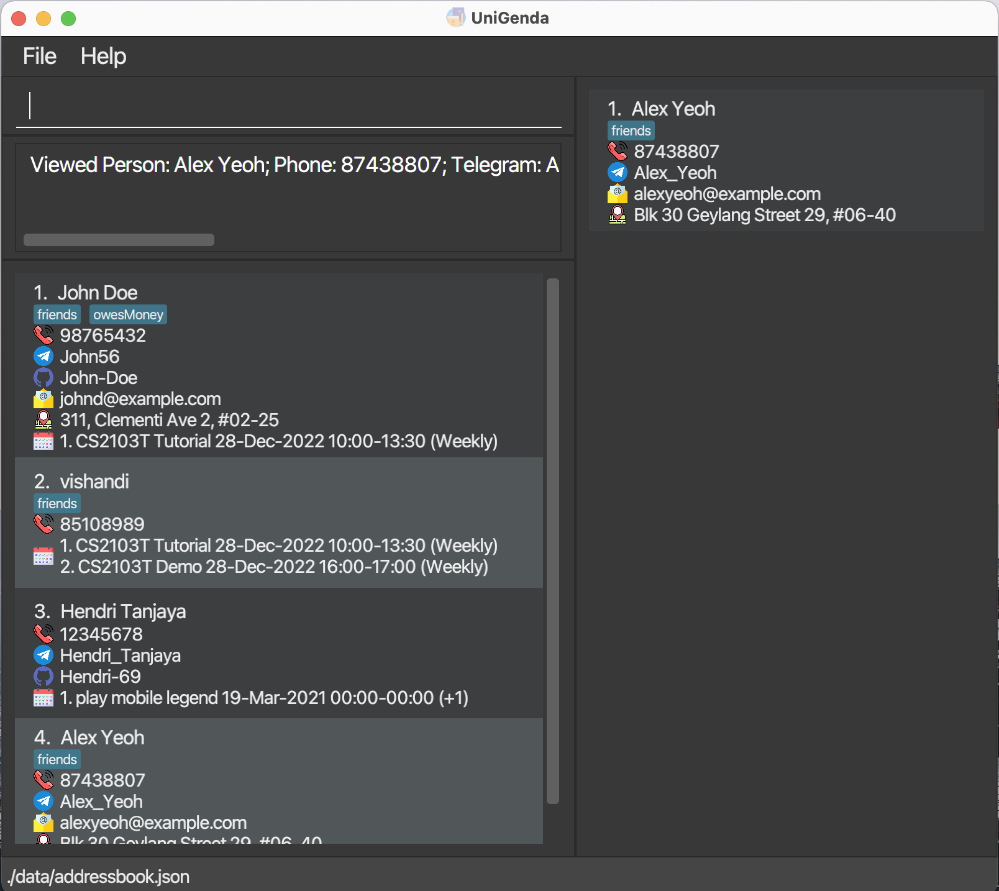

UniGenda is a **desktop app for managing contacts and schedules**, optimized for use via a Command Line Interface (CLI) while still having the benefits of a Graphical User Interface (GUI). If you are a university student having a hard time organising your timetable, or commonly find difficulty scheduling a suitable time to meet up with your project group mates or friends, UniGenda is the app just for you!

With features such as the ability to import your friends' schedules, find friends who are free at a certain date and time, and find common timings to meet with your project teammates, UniGenda makes your university life easier by helping you keep track of not only your own, but also your friends' schedules!

# Table of Contents
1. [Quick Start](#quick-start)
2. [Features](#features)
   1. [Viewing help](#viewing-help--help)
   2. [Adding a person](#adding-a-person-add)
   3. [Listing all persons](#listing-all-persons--list)
   4. [Editing a person](#editing-a-person--edit)
   5. [Locating persons by name](#locating-persons-by-name-find)
   6. [Deleting a person](#deleting-a-person--delete)
   7. [Setting a contact as the user](#setting-a-contact-as-the-user--setuser)
   8. [Viewing a person's schedule](#viewing-a-persons-schedule--viewschedule)
   9. [Viewing persons by tags](#viewing-persons-by-tags-viewgroup)
   10. [Adding a person's schedule](#adding-a-persons-schedule-addevent)
   11. [Editing a person's schedule](#editing-a-persons-schedule-editevent)
   12. [Deleting a person's schedule](#deleting-a-persons-schedule-deleteevent)
   13. [Getting persons who are free](#getting-persons-who-are-free-whoisfree)
   14. [Getting common free timings of persons by tag](#getting-common-free-timing-of-persons-by-tag-findcommontiming)
   15. [Importing a person's schedule](#importing-a-persons-schedule-importschedule)
   16. [Exporting a person's schedule](#exporting-a-persons-schedule-exportschedule)
   17. [Clearing a person's schedule](#clearing-a-persons-schedule-clearschedule)
   18. [Clearing all entries](#clearing-all-entries--clear)
   19. [Exiting the program](#exiting-the-program--exit)
   20. [Saving the data](#saving-the-data)
   21. [Editing the data file](#editing-the-data-file)
3. [FAQ](#faq)
4. [Command Summary](#command-summary)

--------------------------------------------------------------------------------------------------------------------

## Quick Start

1. Ensure you have Java `11` or above installed in your Computer.

1. Download the latest `UniGenda.jar` from [here](https://github.com/AY2122S2-CS2103T-W09-1/tp/releases)*.

1. Copy the file to the folder you want to use as the _home folder_ for your UniGenda.

1. Double-click the file to start the app. The GUI similar to the below should appear in a few seconds. Note how the app contains some sample data. 
   

1. Type the command in the command box and press Enter to execute it. e.g. typing **`help`** and pressing Enter will open the help window. 
   Some example commands you can try:

   * **`list`** : Lists all contacts.

   * **`add`**`n/John Doe p/98765432 e/johnd@example.com a/John street, block 123, #01-01` : Adds a contact named `John Doe` to UniGenda.

   * **`delete`**`3` : Deletes the 3rd contact shown in the current list.

   * **`addEvent`**`1 ed/CS2103T Tutorial da/2022-03-16 ti/10:00 du/1` : Adds a CS2103T Tutorial event to the first contact.

   * **`exit`** : Exits the app.

1. Refer to the [Features](#features) below for details of each command.

\* Will be released soon! Stay tuned!

--------------------------------------------------------------------------------------------------------------------

## Features

**:information_source: Notes about the command format:** 

* Words in `UPPER_CASE` are the parameters to be supplied by the user. 
  e.g. in `add n/NAME`, `NAME` is a parameter which can be used as `add n/John Doe`.

* Items in square brackets are optional. 
  e.g `n/NAME [t/TAG]` can be used as `n/John Doe t/friend` or as `n/John Doe`.

* Items with `…`​ after them can be used multiple times including zero times. 
  e.g. `[t/TAG]…​` can be used as ` ` (i.e. 0 times), `t/friend`, `t/friend t/family` etc.

* Parameters can be in any order. 
  e.g. if the command specifies `n/NAME p/PHONE_NUMBER`, `p/PHONE_NUMBER n/NAME` is also acceptable.

* If a parameter is expected only once in the command, but you specified it multiple times, only the last occurrence of the parameter will be taken. 
  e.g. if you specify `p/12341234 p/56785678`, only `p/56785678` will be taken.

* Extraneous parameters for commands that do not take in parameters (such as `help`, `list`, `exit` and `clear`) will be ignored. 
  e.g. if the command specifies `help 123`, it will be interpreted as `help`.

* All leading and trailing whitespaces will be trimmed for each input to each prefix.

* All commands are case-insensitive. For example `addevent` or `AdDEvenT` works for `addEvent` commands.

### Viewing help : `help`

Shows a message explaining how to access the help page.

Format: `help`

### Adding a person: `add`

Adds a person to UniGenda.

Format: `add n/NAME p/PHONE_NUMBER [tg/TELEGRAM] [gh/GITHUB] [e/EMAIL] [a/ADDRESS] [t/TAG]...`

* `NAME` should only contain alphanumeric characters and be at most 30 characters long. It should not be blank.
* `PHONE_NUMBER` should only contain numeric characters, and should be 3-15 digits long.
* `TELEGRAM`, if specified, should only contain alphanumeric characters and underscore (_), and should be 5-40 characters long. It also should not have multiple consecutive underscores or begin or end with an underscore, or be blank.
* `GITHUB`, if specified, should only contain alphanumeric characters and hyphen (-), and be at most 39 characters long. It also should not have multiple consecutive hyphens or begin or end with a hyphen, or be blank.
* `ADDRESS` should only contain alphanumeric characters and the following punctuations: **!"#$&'()\*+,-.:;<=>?@**. Its length should not exceed 80 characters.
* `EMAIL` should be a **valid** email with length not exceeding 60 characters.
* **Valid** `EMAIL` are emails that are of the format *local-part@domain* and adhere to the following constraints:
  * The local-part should only contain alphanumeric characters and the following special characteres: **+_.-**. It cannot start or end with any special characters and cannot have consecutive special characters.
  * The domain part is made up of domain labels separated by periods (e.g. domain-label1.domain-label2.com). It must end with a domain label at least 2 characters long, each domain label starts and end with alphanumeric characters, and each domain label consists of only alphanumeric characters, separated only by hyphens, if any.
* `TAG` should only contain alphanumeric characters and be at most 30 characters long. It should not contain whitespaces and cannot be blank.
* `TAG` is case-insensitive (`BestFriend` and `bestFriend` will be considered the same tag) and will be converted to the lowercase for display. Duplicate tags will be ignored.
* You cannot add duplicate persons. Persons are considered to be duplicates if they share the same name (case-insensitive) and phone number.

Examples:
* add n/John Doe p/98765432
* add n/Betsy Crow t/friend p/1234567 a/Newgate Prison t/Criminal

### Listing all persons : `list`

Shows a list of all persons in UniGenda.

Format: `list`

### Editing a person : `edit`

Edits an existing person in the UniGenda.

Format: `edit INDEX [n/NAME] [p/PHONE_NUMBER] [tg/TELEGRAM] [gh/GITHUB] [e/EMAIL] [a/ADDRESS] [t/TAG]...`

* Edits the person at the specified `INDEX`. The index refers to the index number shown in the displayed person list. The index **must be a positive integer** 1, 2, 3, …​
* At least one of the optional fields must be provided.
* Existing values will be updated to the input values.
* When editing tags, the existing tags of the person will be removed i.e adding of tags is not cumulative.
* You can remove all the person’s tags by typing `t/` without specifying any tags after it.
* You can also remove telegram, github, email, or address by typing its corresponding prefix without specifying anything after it.
* `NAME` should only contain alphanumeric characters and be at most 30 characters long. It should not be blank.
* `PHONE_NUMBER` should only contain numeric characters, and should be 3-15 digits long.
* `TELEGRAM`, if specified, should only contain alphanumeric characters and underscore (_), and should be 5-40 characters long. It also should not have multiple consecutive underscores or begin or end with an underscore.
* `GITHUB`, if specified, should only contain alphanumeric characters and hyphen (-), and be at most 39 characters long. It also should not have multiple consecutive hyphens or begin or end with a hyphen.
* `ADDRESS` should only contain alphanumeric characters and the following punctuations: **!"#$&'()\*+,-.:;<=>?@**. Its length should not exceed 80 characters.
* `EMAIL` should be a **valid** email with length not exceeding 60 characters.
* **Valid** `EMAIL` are emails that are of the format *local-part@domain* and adhere to the following constraints:
    * The local-part should only contain alphanumeric characters and the following special characteres: **+_.-**. It cannot start or end with any special characters and cannot have consecutive special characters.
    * The domain part is made up of domain labels separated by periods (e.g. domain-label1.domain-label2.com). It must end with a domain label at least 2 characters long, each domain label starts and end with alphanumeric characters, and each domain label consists of only alphanumeric characters, separated only by hyphens, if any.
* `TAG` should only contain alphanumeric characters and be at most 30 characters long. It should not contain whitespaces and cannot be blank.
* `TAG` is case-insensitive (`BestFriend` and `bestFriend` will be considered the same tag) and will be converted to the lowercase for display. Duplicate tags will be ignored and only one will be taken.
* Editing `TAG` will replace the Person's current `TAG`s with the newly inputted `TAG`s.
* You cannot edit a person's name and/or phone number such that there will be duplicate persons in UniGenda. Persons are considered to be duplicates if they share the same name (case-insensitive) and phone number.

Examples:
* `edit 1 p/91234567 e/johndoe@example.com` Edits the phone number and email address of the 1st person to be `91234567` and `johndoe@example.com` respectively.
* `edit 2 n/Betsy Crower t/` Edits the name of the 2nd person to be `Betsy Crower` and clears all existing tags.
* `edit 1 p/91234567 e/` Removes the 1st person's email address, if it exists previously.

### Locating persons by name: `find`

Finds persons whose names contain any of the given keywords.

Format: `find KEYWORD [MORE_KEYWORDS]`

* The search is case-insensitive. e.g `hans` will match `Hans`.
* The order of the keywords does not matter. e.g. `Hans Bo` will match `Bo Hans`.
* Only the name is searched.
* Only full words will be matched e.g. `Han` will not match `Hans`.
* Persons matching at least one keyword will be returned (i.e. `OR` search).
  e.g. `Hans Bo` will return `Hans Gruber`, `Bo Yang`.

Examples:
* `find John` returns `john` and `John Doe`
* `find alex david` returns `Alex Yeoh`, `David Li` 
  

### Deleting a person : `delete`

Deletes the specified person from UniGenda.

Format: `delete INDEX`

* Deletes the person at the specified `INDEX`. The index refers to the index number shown in the displayed person list. The index **must be a positive integer** 1, 2, 3, …​

Examples:
* `list` followed by `delete 2` deletes the 2nd person in UniGenda
* `find Betsy` followed by `delete 1` deletes the 1st person in the results of the `find` command

### Setting a contact as the user : `setUser`

Shifts the contact to the top of the list.

Format: `setUser INDEX`

* Sets the person at the specified `INDEX` as the user. The index refers to the index number shown in the displayed person list. The index **must be a positive integer** 1, 2, 3, …​

Examples:
* `list` followed by `setUser 2` sets the 2nd person in UniGenda as the user
* `find Betsy` followed by `setUser 1` sets the 1st person in the results of the `find` command as the user

### Viewing a person's schedule : `viewSchedule`

Views the specified person's schedule. 

Format: `viewSchedule INDEX`

* Views the schedule of the person at the specified `INDEX`. The index refers to the index number shown in the displayed person list. The index **must be a positive integer** 1, 2, 3, …​
* The person's schedule for the next 7 days (from system's date, including the current date) will be shown, along with the person's full list of events.
* The schedule will be displayed in the right panel of UniGenda.
* If you change your system's time, the Upcoming Schedule will **not** update automatically. You need to enter the command once again to view the updated Upcoming Schedule.
* If a certain Event has passed according to your system's time, it will **not** update automatically as well. You need to enter the command once again to view the updated Upcoming Schedule.

Examples:
* `list` followed by `viewSchedule 4` views the 4th person in UniGenda
  
* `find Betsy` followed by `viewSchedule 1` views the 1st person in the results of the `find` command

### Viewing persons by tags: `viewGroup`

Shows a list of all persons with the specified tag.

Format: `viewGroup t/TAG`

Examples:
* `viewGroup t/groupmates`

### Adding a person’s schedule: `addEvent`

Adds an event to the schedule of the specified person.

Format: `addEvent INDEX ed/EVENT_DESCRIPTION da/DATE [ti/TIME] [du/DURATION] [r/RECUR_FREQUENCY]`

* Adds an event to the schedule of the person at the specified `INDEX`. The index refers to the index number shown in the displayed person list. The index **must be a positive integer** 1, 2, 3, …​
* You cannot add duplicate events. Events are considered to be duplicates if they share the same event description, time, duration, recur frequency and recur on the same dates.

  :information_source: **NOTE:** CS2103T Tutorial 2022-01-01 10:00-11:00 (Weekly) is considered the same event as CS2103T Tutorial 2022-01-08 10:00-11:00 (Weekly) because they eventually recur on the same dates.

* If `TIME` is not specified, the added event will have a duration of 24 hours and start from 00:00.
* If `TIME` is specified but not `DURATION`, the duration will be defaulted to 2 hours.
* If `DURATION` is specified, `TIME` also needs to be specified.
* `EVENT_DESCRIPTION` should not contain **/** and should be at most 60 characters.
* `DATE` should be a valid date in "YYYY-MM-DD" format, and **YYYY must be between 2000-2100**.
* `TIME` should be a valid time in "HH:MM" format.
* `DURATION`, if provided, should be in one of the following formats (case-insensitive):

| Value  | Duration          | Example |
|--------|-------------------|---------|
| `HhMm` | H hours M minutes | `3h30m` |
| `Hh`   | H hours           | `2h`    |
| `Mm`   | M minutes         | `20m`   |
| `H`    | H hours           | `3`     |

* Duration **must be at least 1 minute long and less than or equal to 336hours (2 weeks)**
* `RECUR_FREQUENCY`, if provided, must be one of the following values (case-insensitive):

| Value            | Frequency |
|------------------|-----------|
| `D`, `DAILY`     | Daily     |
| `W`, `WEEKLY`    | Weekly    |
| `BW`, `BIWEEKLY` | Biweekly  |

Examples:
* `addEvent 3 ed/Open House da/2022-12-20`
* `addEvent 2 ed/CCA Meeting da/2023-11-23 ti/12:00 du/1H30M r/W`
* `addEvent 1 ed/CS2103T Coding da/2023-10-23 ti/12:00 du/1H30M r/Daily`

### Editing a person’s schedule: `editEvent`

Edits the specified event in the schedule of the specified person.

Format: `editEvent INDEX EVENT_INDEX [ed/EVENT_DESCRIPTION] [da/DATE] [ti/TIME] [du/DURATION] [r/RECUR_FREQUENCY]`

* `INDEX` refers to the index number shown in the displayed person list, whereas `EVENT_INDEX` refers to the index number shown in the person's full schedule. Both indices **must be positive integers** 1, 2, 3, …​
* At least one of the optional fields must be provided.
* You cannot edit an event's description, date, time, duration and/or recurring frequency such that there will be duplicate events in UniGenda. Events are considered to be duplicates if they share the same event description, time, duration, recur frequency and recur on the same dates.

  :information_source: **NOTE:** CS2103T Tutorial 2022-01-01 10:00-11:00 (Weekly) is considered the same event as CS2103T Tutorial 2022-01-08 10:00-11:00 (Weekly) because they eventually recur on the same dates.

* `EVENT_DESCRIPTION` should not contain **/** and at most 60 characters.
* `DATE` should be a valid date in "YYYY-MM-DD" format, and **YYYY must be between 2000-2100**.
* `TIME` should be a valid time in "HH:MM" format.
* `DURATION`, if provided, should be in one of the following formats (case-insensitive):

| Format | Duration          | Example |
|--------|-------------------|---------|
| `HhMm` | H hours M minutes | `3h30m` |
| `Hh`   | H hours           | `2h`    |
| `Mm`   | M minutes         | `20m`   |
| `H`    | H hours           | `3`     |

* Duration **must be at least 1 minute long and less than or equal to 336hours (2 weeks)**
* RECUR_FREQUENCY, if provided, must be one of the following values (case-insensitive) :

| Value            | Frequency |
|------------------|-----------|
| `D`, `DAILY`     | Daily     |
| `W`, `WEEKLY`    | Weekly    |
| `BW`, `BIWEEKLY` | Biweekly  |

Example:
* `editEvent 3 3 da/2022-12-21`
* `editEvent 3 1 ed/CS2103T tutorial da/2022-12-18 ti/14:00 du/2`
* `editEvent 3 1 ed/CS2103T lecture`

### Deleting a person's schedule: `deleteEvent`

Deletes an event from the schedule of the specified person.

Format: `deleteEvent INDEX EVENT_INDEX`

* `INDEX` refers to the index number shown in the displayed person list, whereas `EVENT_INDEX` refers to the index number shown in the person's full schedule. Both indices **must be positive integers** 1, 2, 3, …​

Example:
* `deleteEvent 3 3`

### Getting persons who are free: `whoIsFree`

Shows a list of persons who are free at specified time and date. You may also choose to additionally filter the list using tags.

Format: `whoIsFree ti/TIME [da/ DATE] [t/TAG]`

* `TIME` should be a valid time in "HH:MM" format.
* `DATE` should be a valid date in "YYYY-MM-DD" format.

Examples:
* `whoIsFree ti/12:00`
* `whoIsFree ti/14:00 da/2022-02-14`
* `whoIsFree ti/12:00 t/friends`

### Getting common free timing of persons by tag: `findCommonTiming`
Gets the common timings of persons who are free with the same tag on a certain day.

Format: `findCommonTiming t/TAG da/DATE`
* Show the overlapping timings that a group of friends with the same tags are free on a certain day.

Example:
* `findCommonTiming t/groupmates da/2022-03-04`

### Importing a person's schedule: `importSchedule`

Imports a schedule from a file to the specified person. The specified person's schedule will be overwritten.

Format: `importSchedule INDEX pa/FILE_PATH`

* Imports a schedule to the person at the specified `INDEX`. The index refers to the index number shown in the displayed person list. The index **must be a positive integer** 1, 2, 3, …​
* The file's data **must be in json format**, but the file itself may have any extension (e.g. .json, .txt etc.).
* The imported `Schedule` **cannot be empty**.
* `FILE_PATH` may be absolute or relative to the folder where the application was opened. More information of absolute and relative file paths can be found [here](https://www.educative.io/edpresso/absolute-vs-relative-path).

  :exclamation: **Caution:** The person's schedule will be **overwritten** with the imported schedule.

Examples:
`importSchedule 1 pa/typicalSchedule.json`

### Exporting a person's schedule: `exportSchedule`

Format: `exportSchedule INDEX`

* Allows user to export schedule of person at specified `INDEX`. The index refers to the index number shown in the displayed person list. The index **must be a positive integer** 1, 2, 3, …​
* The exported data will be named `[NAME].json`, where `[NAME]` is the name of the person on index `INDEX`.
* The exported data will be saved in the `data/export/` folder relative to the folder where the application was opened.

Examples:
* `exportSchedule 1`

### Clearing a person's schedule: `clearSchedule`

Format: `clearSchedule INDEX`

* Clears the schedule of the person at the specified `INDEX`. The index refers to the index number shown in the displayed person list. The index **must be a positive integer** 1, 2, 3, …​

### Clearing all entries : `clear`

Clears all entries from UniGenda.

Format: `clear`

### Exiting the program : `exit`

Exits the program.

Format: `exit`

### Saving the data

UniGenda data are saved in the hard disk automatically after any command that changes the data. There is no need to save manually.

### Editing the data file

UniGenda data are saved as a JSON file `[JAR file location]/data/addressbook.json`. Advanced users are welcome to update data directly by editing that data file.

:exclamation: **Caution:**
If your changes to the data file makes its format invalid, UniGenda
will discard all data and start with an empty data file at the next run.

--------------------------------------------------------------------------------------------------------------------

## FAQ

**Q**: How do I transfer my data to another Computer? 
**A**: Install the app in the other computer and overwrite the empty data file it creates with the file that contains the data of your previous UniGenda home folder.

--------------------------------------------------------------------------------------------------------------------

## Command Summary
| Action               | Format, Examples                                                                                                                                                                              |
|----------------------|-----------------------------------------------------------------------------------------------------------------------------------------------------------------------------------------------|
| **Add**              | `add n/NAME p/PHONE_NUMBER [e/EMAIL] [a/ADDRESS] [t/TAG]…​`   e.g., `add n/James Ho p/22224444 e/jamesho@example.com a/123, Clementi Rd, 1234665 t/friend t/colleague`                     |
| **Clear**            | `clear`                                                                                                                                                                                       |
| **Delete**           | `delete INDEX`  e.g., `delete 3`                                                                                                                                                           |
| **Edit**             | `edit INDEX [n/NAME] [p/PHONE_NUMBER] [e/EMAIL] [a/ADDRESS] [t/TAG]…​`  e.g.,`edit 2 n/James Lee e/jameslee@example.com`                                                                   |
| **SetUser**          | `setUser INDEX`  e.g., `setUser 3`                                                                                                                                                         |
| **ViewGroup**        | `viewGroup t/tag` e.g., `viewGroup t/groupmates`                                                                                                                                           |
| **ViewSchedule**     | `viewSchedule INDEX` e.g., `viewSchedule 1`                                                                                                                                                |
| **AddEvent**         | `addEvent INDEX ed/EVENT_DESCRIPTION da/DATE [ti/TIME] [du/DURATION] [r/RECUR_FREQUENCY]`   e.g., `1 ed/CS2103T Tutorial da/2022-03-16 ti/10:00 du/1 r/WEEKLY`                             |
| **EditEvent**        | `editEvent INDEX EVENT_INDEX [ed/EVENT_DESCRIPTION] [da/DATE] [ti/TIME] [du/DURATION] [r/RECUR_FREQUENCY]`   e.g., `editEvent 3 1 ed/CS2103T tutorial da/18-12-2022 ti/1400 du/2 r/WEEKLY` |
| **DeleteEvent**      | `deleteEvent INDEX EVENT_NUMBER`   e.g., `deleteEvent 3 3`                                                                                                                                 |
| **WhoIsFree**        | `whoIsFree ti/TIME [da/DATE]`  e.g., `whoIsFree ti/10:00 da/2022-03-14`                                                                                                                    |
| **FindCommonTiming** | `findCommonTiming t/TAG da/DATE`  e.g., `findCommonTiming t/groupmates da/2022-03-04`                                                                                                      |
| **ImportSchedule**   | `importSchedule 1 pa/FILE_PATH`  e.g., `importSchedule 1 pa/typicalSchedule.json`                                                                                                          |
| **ExportSchedule**   | `exportSchedule INDEX`  e.g., `exportSchedule 1`                                                                                                                                           |
| **ClearSchedule**    | `clearSchedule`                                                                                                                                                                               |
| **Find**             | `find KEYWORD [MORE_KEYWORDS]`  e.g., `find James Jake`                                                                                                                                    |
| **List**             | `list`                                                                                                                                                                                        |
| **Help**             | `help`                                                                                                                                                                                        |
